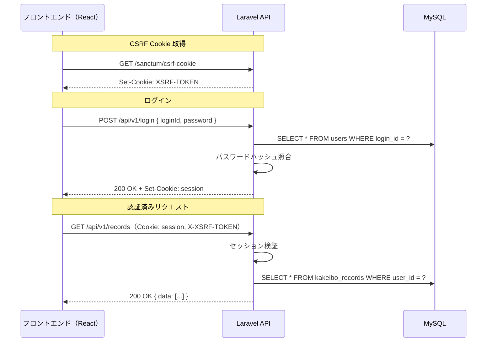
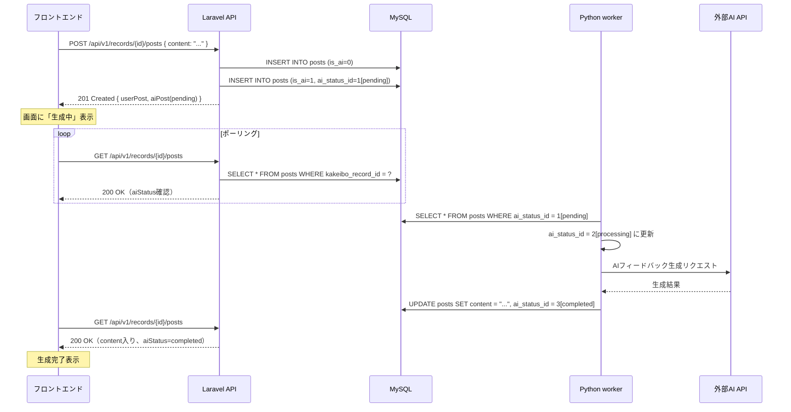

# 最新型家計簿！「レスマネ」　API設計書

## 1. 文書情報

| 項目           | 内容                       |
| -------------- | -------------------------- |
| 文書名         | API設計書                  |
| プロジェクト名 | 最新型家計簿！「レスマネ」 |
| チーム名       | 節約志向になりたい         |
| 作成日         | 2026-06-12                 |
| 最終更新日     | 2026-06-12                 |
| 作成者         | 節約志向になりたい         |
| 版数           | v1.0                       |

### 1.1 改訂履歴

| 版数 | 日付       | 更新者    | 更新内容 |
| ---- | ---------- | --------- | -------- |
| v1.0 | 2026-06-12 | 小川 悠馬 | 初版作成 |

---

## 2. 前提

本書は、要件定義書・技術構成書・テーブル定義書・コーディング規約に基づき、Laravel 10（API サーバー）が提供する REST API のエンドポイントを定義する。

### 2.1 基本方針

| 項目             | 内容                                                                 |
| ---------------- | -------------------------------------------------------------------- |
| 提供形態         | JSON API（`Content-Type: application/json`）                         |
| ベースパス       | `/api/v1`                                                            |
| 認証方式         | セッションベース認証（Laravel Sanctum / Cookie）                     |
| 認可             | 認証済みユーザーは自身のデータのみ操作可能。他ユーザーのデータへのアクセスは 403 で拒否する |
| 入力値検証       | サーバー側で必ず検証する（Laravel FormRequest）                      |
| ソフトデリート   | テーブル定義書に `deleted_at` が存在するテーブルは論理削除を使用する |
| タイムスタンプ   | `created_at` / `updated_at` は Laravel の Eloquent が自動管理する    |
| 日時フォーマット | ISO 8601（`YYYY-MM-DDTHH:mm:ss.000000Z`）                           |
| フィールド命名   | API のリクエスト・レスポンスの JSON キーはキャメルケース（`camelCase`）とする。DB カラム名（`snake_case`）とは Laravel の API Resource 層で変換する |
| ルート命名       | `snake_case`（ドット区切り）（コーディング規約準拠）                 |
| AI生成処理       | Laravel 本体は同期的に AI を呼ばない。生成要求の登録のみ行い、Python worker が非同期で処理する |

### 2.2 エラー設計

#### 2.2.1 エラーレスポンス形式

すべてのエンドポイントは、エラー時に以下の共通形式で JSON を返す。フロントエンドは HTTP ステータスコードでエラー種別を判定する。

```json
{
  "message": "利用者向けエラーメッセージ",
  "errors": {}
}
```

| フィールド | 型     | 説明                                                                 |
| ---------- | ------ | -------------------------------------------------------------------- |
| `message`  | string | 利用者に表示可能なエラーメッセージ（日本語）                         |
| `errors`   | object | フィールド単位のエラー詳細。バリデーションエラー（422）のみ値が入る。それ以外は空オブジェクト `{}` |

#### 2.2.2 HTTP ステータスコードの使い分け

| HTTPステータス | 意味                         | `errors` の内容 | フロントエンドの処理                       |
| -------------- | ---------------------------- | --------------- | ------------------------------------------ |
| 401            | 未認証・認証失敗             | `{}`            | ログイン画面へ遷移、またはメッセージ表示   |
| 403            | 権限なし（他ユーザーのリソース等） | `{}`      | メッセージ表示                             |
| 404            | リソースが存在しない         | `{}`            | メッセージ表示、一覧へ遷移等               |
| 409            | 競合（ログインID・メール重複等） | `{}`        | メッセージ表示                             |
| 422            | バリデーションエラー         | フィールド別    | 各フィールドにエラーメッセージを表示       |
| 500            | サーバー内部エラー           | `{}`            | メッセージ表示                             |
| 503            | 外部サービス利用不可         | `{}`            | メッセージ表示（AI以外の操作は継続可能）   |

#### 2.2.3 エラーパターンと JSON 例

##### バリデーションエラー（422）

`errors` にフィールド名（キャメルケース）をキー、メッセージの配列を値として格納する。

```json
{
  "message": "入力内容に誤りがあります",
  "errors": {
    "loginId": ["ログインIDは必須です"],
    "password": ["パスワードは8文字以上で入力してください"],
    "email": ["メールアドレスの形式が正しくありません"]
  }
}
```

##### 認証エラー（401）

```json
{
  "message": "ログインが必要です",
  "errors": {}
}
```

```json
{
  "message": "ログインIDまたはパスワードが正しくありません",
  "errors": {}
}
```

##### 権限エラー（403）

```json
{
  "message": "このレコードへのアクセス権限がありません",
  "errors": {}
}
```

##### リソース不在（404）

```json
{
  "message": "指定された家計簿レコードが見つかりません",
  "errors": {}
}
```

##### 競合（409）

```json
{
  "message": "このログインIDは既に使用されています",
  "errors": {}
}
```

##### サーバーエラー（500）

```json
{
  "message": "サーバー内部でエラーが発生しました",
  "errors": {}
}
```

---

## 3. エンドポイント一覧

### 3.1 認証（F-001 / F-002）

| メソッド | パス               | 機能ID | 概要           | ルート名          |
| -------- | ------------------ | ------ | -------------- | ----------------- |
| POST     | `/api/v1/register`    | F-001  | ユーザー登録   | `auth.register`   |
| POST     | `/api/v1/login`       | F-002  | ログイン       | `auth.login`      |
| POST     | `/api/v1/logout`      | -      | ログアウト     | `auth.logout`     |

### 3.2 家計簿レコード（F-003 / F-004 / F-012 / F-013）

| メソッド | パス                     | 機能ID | 概要           | ルート名            |
| -------- | ------------------------ | ------ | -------------- | ------------------- |
| GET      | `/api/v1/records`           | F-004  | 家計簿一覧取得 | `kakeibo.index`     |
| POST     | `/api/v1/records`           | F-003  | 家計簿登録     | `kakeibo.store`     |
| GET      | `/api/v1/records/{id}`      | F-004  | 家計簿詳細取得 | `kakeibo.show`      |
| PUT      | `/api/v1/records/{id}`      | F-012  | 家計簿編集     | `kakeibo.update`    |
| DELETE   | `/api/v1/records/{id}`      | F-013  | 家計簿削除     | `kakeibo.destroy`   |

### 3.3 自己レビュー（F-006 / F-007 / F-014 / F-015）

| メソッド | パス                                     | 機能ID | 概要               | ルート名              |
| -------- | ---------------------------------------- | ------ | ------------------ | --------------------- |
| GET      | `/api/v1/records/{recordId}/reviews`        | F-007  | 自己レビュー一覧取得 | `review.index`      |
| POST     | `/api/v1/records/{recordId}/reviews`        | F-006  | 自己レビュー投稿   | `review.store`        |
| PUT      | `/api/v1/records/{recordId}/reviews/{id}`   | F-014  | 自己レビュー編集   | `review.update`       |
| DELETE   | `/api/v1/records/{recordId}/reviews/{id}`   | F-015  | 自己レビュー削除   | `review.destroy`      |

### 3.4 スレッド・AIメッセージ（F-007 / F-008 / F-011）

| メソッド | パス                                     | 機能ID      | 概要                       | ルート名            |
| -------- | ---------------------------------------- | ----------- | -------------------------- | ------------------- |
| GET      | `/api/v1/records/{recordId}/posts`          | F-007       | スレッド（投稿一覧）取得   | `post.index`        |
| POST     | `/api/v1/records/{recordId}/posts`          | F-008 / F-011 | AIフィードバック要求 / AIコミュニケーション投稿 | `post.store` |

### 3.5 基準値設定（F-005）

| メソッド | パス                    | 機能ID | 概要             | ルート名                  |
| -------- | ----------------------- | ------ | ---------------- | ------------------------- |
| GET      | `/api/v1/settings/limit`   | F-005  | 基準値設定取得   | `settings.limit.show`     |
| PUT      | `/api/v1/settings/limit`   | F-005  | 基準値設定更新   | `settings.limit.update`   |

### 3.6 ユーザー情報（F-009 / F-010）

| メソッド | パス                  | 機能ID | 概要                 | ルート名            |
| -------- | --------------------- | ------ | -------------------- | ------------------- |
| GET      | `/api/v1/user`           | F-009  | ログインユーザー取得 | `user.show`         |
| PUT      | `/api/v1/user`           | F-009  | ユーザー情報編集     | `user.update`       |
| DELETE   | `/api/v1/user`           | F-010  | ユーザー退会         | `user.destroy`      |

### 3.7 マスタデータ

| メソッド | パス                    | 概要                   | ルート名              |
| -------- | ----------------------- | ---------------------- | --------------------- |
| GET      | `/api/v1/categories`       | カテゴリ一覧取得       | `category.index`      |
| GET      | `/api/v1/amountTypes`     | 収支区分一覧取得       | `amount_type.index`   |

---

## 4. エンドポイント詳細

### 4.1 POST `/api/v1/register`

ユーザー登録（F-001）

**リクエスト**

| フィールド             | 型     | 必須 | バリデーション                         |
| ---------------------- | ------ | ---- | -------------------------------------- |
| `loginId`              | string | ○    | 1〜15文字、一意（`users.login_id`）     |
| `email`                | string | ○    | メール形式、255文字以内、一意          |
| `name`                 | string | ○    | 1〜50文字                              |
| `password`             | string | ○    | 8文字以上、確認用と一致               |
| `passwordConfirmation` | string | ○    | `password` と一致                     |

```json
{
  "loginId": "taro123",
  "email": "taro@example.com",
  "name": "太郎",
  "password": "password123",
  "passwordConfirmation": "password123"
}
```

**レスポンス（201 Created）**

```json
{
  "user": {
    "id": 1,
    "loginId": "taro123",
    "email": "taro@example.com",
    "name": "太郎",
    "createdAt": "2026-06-12T10:00:00.000000Z"
  }
}
```

登録完了と同時にセッションを開始し、認証済み状態とする。

**エラーレスポンス**

バリデーションエラー（422）:

```json
{
  "message": "入力内容に誤りがあります",
  "errors": {
    "loginId": ["ログインIDは必須です", "ログインIDは15文字以内で入力してください"],
    "email": ["メールアドレスの形式が正しくありません"],
    "password": ["パスワードは8文字以上で入力してください"],
    "passwordConfirmation": ["パスワード（確認用）が一致しません"]
  }
}
```

ログインID重複（409）:

```json
{
  "message": "このログインIDは既に使用されています",
  "errors": {}
}
```

メールアドレス重複（409）:

```json
{
  "message": "このメールアドレスは既に使用されています",
  "errors": {}
}
```

---

### 4.2 POST `/api/v1/login`

ログイン（F-002）

**リクエスト**

| フィールド | 型     | 必須 | バリデーション  |
| ---------- | ------ | ---- | --------------- |
| `loginId`  | string | ○    | 必須            |
| `password` | string | ○    | 必須            |

```json
{
  "loginId": "taro123",
  "password": "password123"
}
```

**レスポンス（200 OK）**

```json
{
  "user": {
    "id": 1,
    "loginId": "taro123",
    "email": "taro@example.com",
    "name": "太郎",
    "createdAt": "2026-06-12T10:00:00.000000Z"
  }
}
```

**エラーレスポンス**

認証失敗（401）:

```json
{
  "message": "ログインIDまたはパスワードが正しくありません",
  "errors": {}
}
```

バリデーションエラー（422）:

```json
{
  "message": "入力内容に誤りがあります",
  "errors": {
    "loginId": ["ログインIDは必須です"]
  }
}
```

---

### 4.3 POST `/api/v1/logout`

ログアウト（認証必須）

**リクエスト**

ボディなし。

**レスポンス（204 No Content）**

ボディなし。セッションを破棄する。

**エラーレスポンス**

未認証（401）:

```json
{
  "message": "ログインが必要です",
  "errors": {}
}
```

---

### 4.4 GET `/api/v1/records`

家計簿一覧取得（F-004）（認証必須）

**クエリパラメータ**

| パラメータ     | 型     | 必須 | 説明                                           |
| -------------- | ------ | ---- | ---------------------------------------------- |
| `from`         | string | -    | 取得開始日（`YYYY-MM-DD`）                     |
| `to`           | string | -    | 取得終了日（`YYYY-MM-DD`）                     |
| `amountTypeId` | int    | -    | 収支区分で絞り込み                             |
| `categoryId`   | int    | -    | カテゴリで絞り込み                             |
| `page`         | int    | -    | ページ番号（デフォルト: 1）                    |
| `perPage`      | int    | -    | 1ページあたりの件数（デフォルト: 20、上限: 100） |

**レスポンス（200 OK）**

```json
{
  "data": [
    {
      "id": 1,
      "userId": 1,
      "purchaseDate": "2026-06-10",
      "amountTypeId": 1,
      "amountTypeName": "支出",
      "amount": 1500,
      "details": "コンビニでお昼ご飯",
      "categoryId": 3,
      "categoryName": "食費",
      "createdAt": "2026-06-10T12:00:00.000000Z",
      "updatedAt": "2026-06-10T12:00:00.000000Z"
    }
  ],
  "meta": {
    "currentPage": 1,
    "lastPage": 5,
    "perPage": 20,
    "total": 98
  },
  "summary": {
    "totalIncome": 200000,
    "totalExpense": 85000
  }
}
```

認証ユーザー自身の家計簿のみ返す。`summary` は絞り込み条件適用後の合計。

**エラーレスポンス**

未認証（401）: 4.3 と同形式

クエリパラメータ不正（422）:

```json
{
  "message": "入力内容に誤りがあります",
  "errors": {
    "from": ["取得開始日は日付形式（YYYY-MM-DD）で入力してください"],
    "perPage": ["1ページあたりの件数は100以下で入力してください"]
  }
}
```

---

### 4.5 POST `/api/v1/records`

家計簿登録（F-003）（認証必須）

**リクエスト**

| フィールド                  | 型     | 必須 | バリデーション                                   |
| --------------------------- | ------ | ---- | ------------------------------------------------ |
| `purchaseDate`              | string | -    | 日付形式（`YYYY-MM-DD`）。省略・NULL時は `createdAt` の日付を採用する |
| `amountTypeId`              | int    | ○    | `amount_types.id` に存在すること                  |
| `amount`                    | int    | ○    | 1以上の整数                                      |
| `details`                   | string | ○    | 1〜250文字                                       |
| `kakeiboDefaultCategoryId`  | int    | -    | `kakeibo_default_categories.id` に存在すること（NULL許容） |

```json
{
  "purchaseDate": "2026-06-10",
  "amountTypeId": 1,
  "amount": 1500,
  "details": "コンビニでお昼ご飯",
  "kakeiboDefaultCategoryId": 3
}
```

**レスポンス（201 Created）**

`purchaseDate` が省略・NULL の場合、レスポンスには `createdAt` の日付部分が `purchaseDate` として返る。

```json
{
  "data": {
    "id": 1,
    "userId": 1,
    "purchaseDate": "2026-06-10",
    "amountTypeId": 1,
    "amountTypeName": "支出",
    "amount": 1500,
    "details": "コンビニでお昼ご飯",
    "categoryId": 3,
    "categoryName": "食費",
    "createdAt": "2026-06-10T12:00:00.000000Z",
    "updatedAt": "2026-06-10T12:00:00.000000Z"
  }
}
```

**エラーレスポンス**

未認証（401）: 4.3 と同形式

バリデーションエラー（422）:

```json
{
  "message": "入力内容に誤りがあります",
  "errors": {
    "amountTypeId": ["収支区分は必須です"],
    "amount": ["金額は1以上の整数で入力してください"],
    "details": ["購入詳細は必須です"]
  }
}
```

---

### 4.6 GET `/api/v1/records/{id}`

家計簿詳細取得（F-004）（認証必須）

**パスパラメータ**

| パラメータ | 型  | 説明           |
| ---------- | --- | -------------- |
| `id`       | int | 家計簿レコードID |

**レスポンス（200 OK）**

```json
{
  "data": {
    "id": 1,
    "userId": 1,
    "purchaseDate": "2026-06-10",
    "amountTypeId": 1,
    "amountTypeName": "支出",
    "amount": 1500,
    "details": "コンビニでお昼ご飯",
    "categoryId": 3,
    "categoryName": "食費",
    "createdAt": "2026-06-10T12:00:00.000000Z",
    "updatedAt": "2026-06-10T12:00:00.000000Z"
  }
}
```

**エラーレスポンス**

未認証（401）: 4.3 と同形式

権限なし（403）:

```json
{
  "message": "このレコードへのアクセス権限がありません",
  "errors": {}
}
```

レコードが存在しない（404）:

```json
{
  "message": "指定された家計簿レコードが見つかりません",
  "errors": {}
}
```

---

### 4.7 PUT `/api/v1/records/{id}`

家計簿編集（F-012）（認証必須）

**パスパラメータ**

| パラメータ | 型  | 説明           |
| ---------- | --- | -------------- |
| `id`       | int | 家計簿レコードID |

**リクエスト**

| フィールド                  | 型     | 必須 | バリデーション                                   |
| --------------------------- | ------ | ---- | ------------------------------------------------ |
| `purchaseDate`              | string | -    | 日付形式（`YYYY-MM-DD`）。省略・NULL時は `createdAt` の日付を維持する |
| `amountTypeId`              | int    | ○    | `amount_types.id` に存在すること                  |
| `amount`                    | int    | ○    | 1以上の整数                                      |
| `details`                   | string | ○    | 1〜250文字                                       |
| `kakeiboDefaultCategoryId`  | int    | -    | `kakeibo_default_categories.id` に存在すること（NULL許容） |

**レスポンス（200 OK）**

更新後のレコードを返す（形式は 4.6 と同じ）。

**エラーレスポンス**

未認証（401）: 4.3 と同形式

権限なし（403）: 4.6 と同形式

レコードが存在しない（404）: 4.6 と同形式

バリデーションエラー（422）: 4.5 と同形式

---

### 4.8 DELETE `/api/v1/records/{id}`

家計簿削除（F-013）（認証必須）

**パスパラメータ**

| パラメータ | 型  | 説明           |
| ---------- | --- | -------------- |
| `id`       | int | 家計簿レコードID |

**レスポンス（204 No Content）**

ボディなし。論理削除（`deleted_at` を設定）。紐づく自己レビュー・投稿（AIメッセージ含む）も論理削除する。

**エラーレスポンス**

未認証（401）: 4.3 と同形式

権限なし（403）: 4.6 と同形式

レコードが存在しない（404）: 4.6 と同形式

---

### 4.9 GET `/api/v1/records/{recordId}/reviews`

自己レビュー一覧取得（F-007）（認証必須）

**パスパラメータ**

| パラメータ   | 型  | 説明             |
| ------------ | --- | ---------------- |
| `recordId`   | int | 家計簿レコードID |

**レスポンス（200 OK）**

```json
{
  "data": [
    {
      "id": 1,
      "kakeiboRecordId": 1,
      "reviewComment": "ちょっと贅沢しすぎたかも…",
      "createdAt": "2026-06-10T13:00:00.000000Z",
      "updatedAt": "2026-06-10T13:00:00.000000Z"
    }
  ]
}
```

**エラーレスポンス**

未認証（401）: 4.3 と同形式

権限なし（403）:

```json
{
  "message": "このレビューへのアクセス権限がありません",
  "errors": {}
}
```

家計簿レコードが存在しない（404）:

```json
{
  "message": "紐づく家計簿レコードが見つかりません",
  "errors": {}
}
```

---

### 4.10 POST `/api/v1/records/{recordId}/reviews`

自己レビュー投稿（F-006）（認証必須）

**パスパラメータ**

| パラメータ   | 型  | 説明             |
| ------------ | --- | ---------------- |
| `recordId`   | int | 家計簿レコードID |

**リクエスト**

| フィールド      | 型     | 必須 | バリデーション |
| --------------- | ------ | ---- | -------------- |
| `reviewComment` | string | ○    | 1〜250文字     |

```json
{
  "reviewComment": "ちょっと贅沢しすぎたかも…"
}
```

**レスポンス（201 Created）**

```json
{
  "data": {
    "id": 1,
    "kakeiboRecordId": 1,
    "reviewComment": "ちょっと贅沢しすぎたかも…",
    "createdAt": "2026-06-10T13:00:00.000000Z",
    "updatedAt": "2026-06-10T13:00:00.000000Z"
  }
}
```

投稿成功時、AIフィードバック生成要求を `posts` テーブルに登録する（`is_ai = 1`, `ai_status_id = 1（pending）`）。実際の生成は Python worker が非同期で行う。

**エラーレスポンス**

未認証（401）: 4.3 と同形式

権限なし（403）: 4.9 と同形式

家計簿レコードが存在しない（404）: 4.9 と同形式

バリデーションエラー（422）:

```json
{
  "message": "入力内容に誤りがあります",
  "errors": {
    "reviewComment": ["自己レビューは必須です", "自己レビューは250文字以内で入力してください"]
  }
}
```

---

### 4.11 PUT `/api/v1/records/{recordId}/reviews/{id}`

自己レビュー編集（F-014）（認証必須）

**パスパラメータ**

| パラメータ   | 型  | 説明             |
| ------------ | --- | ---------------- |
| `recordId`   | int | 家計簿レコードID |
| `id`         | int | 自己レビューID   |

**リクエスト**

| フィールド      | 型     | 必須 | バリデーション |
| --------------- | ------ | ---- | -------------- |
| `reviewComment` | string | ○    | 1〜250文字     |

**レスポンス（200 OK）**

更新後のレビューを返す（形式は 4.10 と同じ）。編集に伴うAIの再生成は行わない（要件定義書 F-014 準拠）。

**エラーレスポンス**

未認証（401）: 4.3 と同形式

権限なし（403）: 4.9 と同形式

レビューが存在しない（404）:

```json
{
  "message": "指定された自己レビューが見つかりません",
  "errors": {}
}
```

家計簿レコードが存在しない（404）: 4.9 と同形式

バリデーションエラー（422）: 4.10 と同形式

---

### 4.12 DELETE `/api/v1/records/{recordId}/reviews/{id}`

自己レビュー削除（F-015）（認証必須）

**パスパラメータ**

| パラメータ   | 型  | 説明             |
| ------------ | --- | ---------------- |
| `recordId`   | int | 家計簿レコードID |
| `id`         | int | 自己レビューID   |

**レスポンス（204 No Content）**

ボディなし。論理削除。画面遷移なし（フロントエンドで S-005 内に留まる）。

**エラーレスポンス**

未認証（401）: 4.3 と同形式

権限なし（403）: 4.9 と同形式

レビューが存在しない（404）: 4.11 と同形式

家計簿レコードが存在しない（404）: 4.9 と同形式

---

### 4.13 GET `/api/v1/records/{recordId}/posts`

スレッド（投稿一覧）取得（F-007）（認証必須）

**パスパラメータ**

| パラメータ   | 型  | 説明             |
| ------------ | --- | ---------------- |
| `recordId`   | int | 家計簿レコードID |

**レスポンス（200 OK）**

```json
{
  "data": [
    {
      "id": 1,
      "userId": 1,
      "kakeiboRecordId": 1,
      "isAi": false,
      "aiStatus": null,
      "parentId": null,
      "content": "ちょっと贅沢しすぎたかも…",
      "createdAt": "2026-06-10T13:00:00.000000Z",
      "updatedAt": "2026-06-10T13:00:00.000000Z"
    },
    {
      "id": 2,
      "userId": null,
      "kakeiboRecordId": 1,
      "isAi": true,
      "aiStatus": {
        "id": 3,
        "statusName": "completed"
      },
      "parentId": 1,
      "content": "お気持ちはよく分かります！でも...",
      "createdAt": "2026-06-10T13:01:00.000000Z",
      "updatedAt": "2026-06-10T13:01:00.000000Z"
    }
  ]
}
```

`isAi = true` かつ `aiStatus` が `pending` / `processing` の場合、`content` は `null`（生成中）。フロントエンドは `aiStatus` を見て「生成中」表示を行う。

**エラーレスポンス**

未認証（401）: 4.3 と同形式

権限なし（403）:

```json
{
  "message": "このスレッドへのアクセス権限がありません",
  "errors": {}
}
```

家計簿レコードが存在しない（404）:

```json
{
  "message": "紐づく家計簿レコードが見つかりません",
  "errors": {}
}
```

---

### 4.14 POST `/api/v1/records/{recordId}/posts`

AIフィードバック要求 / AIコミュニケーション投稿（F-008 / F-011）（認証必須）

**パスパラメータ**

| パラメータ   | 型  | 説明             |
| ------------ | --- | ---------------- |
| `recordId`   | int | 家計簿レコードID |

**リクエスト**

| フィールド  | 型     | 必須 | バリデーション                                       |
| ----------- | ------ | ---- | ---------------------------------------------------- |
| `content`   | string | -    | 1〜3000文字（ユーザーメッセージ。省略時はAIフィードバック要求のみ） |
| `parentId`  | int    | -    | リプライ先の投稿ID。同一 `recordId` 内かつ認証ユーザーが参照可能な投稿に限定する |

```json
{
  "content": "もうちょっと具体的にアドバイスほしいです",
  "parentId": 2
}
```

**レスポンス（201 Created）**

```json
{
  "data": {
    "userPost": {
      "id": 3,
      "userId": 1,
      "kakeiboRecordId": 1,
      "isAi": false,
      "aiStatus": null,
      "parentId": 2,
      "content": "もうちょっと具体的にアドバイスほしいです",
      "createdAt": "2026-06-10T14:00:00.000000Z",
      "updatedAt": "2026-06-10T14:00:00.000000Z"
    },
    "aiPost": {
      "id": 4,
      "userId": null,
      "kakeiboRecordId": 1,
      "isAi": true,
      "aiStatus": {
        "id": 1,
        "statusName": "pending"
      },
      "parentId": 3,
      "content": null,
      "createdAt": "2026-06-10T14:00:00.000000Z",
      "updatedAt": "2026-06-10T14:00:00.000000Z"
    }
  }
}
```

ユーザーの投稿を保存すると同時に、AI返信用の投稿レコード（`is_ai = 1`, `ai_status_id = 1（pending）`）を作成する。Python worker が非同期で生成し、`content` と `ai_status_id` を更新する。

`content` を省略した場合は、ユーザー投稿なしでAIフィードバック生成要求のみを行う（F-008：自己レビューがない場合でも家計簿情報をもとに生成できる）。

**エラーレスポンス**

未認証（401）: 4.3 と同形式

権限なし（403）: 4.13 と同形式

家計簿レコードが存在しない（404）: 4.13 と同形式

リプライ先が存在しない（404）:

```json
{
  "message": "リプライ先の投稿が見つかりません",
  "errors": {}
}
```

バリデーションエラー（422）:

```json
{
  "message": "入力内容に誤りがあります",
  "errors": {
    "content": ["投稿内容は3000文字以内で入力してください"]
  }
}
```

AI生成登録失敗（500）:

```json
{
  "message": "AI生成処理の登録に失敗しました",
  "errors": {}
}
```

---

### 4.15 GET `/api/v1/settings/limit`

基準値設定取得（F-005）（認証必須）

**レスポンス（200 OK）**

```json
{
  "data": {
    "id": 1,
    "upperLimitTypeId": 1,
    "upperLimitTypeName": "金額",
    "maxValue": 50000,
    "aveMonthlyIncome": null,
    "createdAt": "2026-06-01T00:00:00.000000Z",
    "updatedAt": "2026-06-10T10:00:00.000000Z"
  }
}
```

未設定の場合は `data: null` を返す。

**エラーレスポンス**

未認証（401）: 4.3 と同形式

---

### 4.16 PUT `/api/v1/settings/limit`

基準値設定更新（F-005）（認証必須）

**リクエスト**

| フィールド          | 型  | 必須 | バリデーション                                         |
| ------------------- | --- | ---- | ------------------------------------------------------ |
| `upperLimitTypeId`  | int | ○    | `upper_limit_types.id` に存在すること                   |
| `maxValue`          | int | -    | 1以上の整数（NULL許容）                                |
| `aveMonthlyIncome`  | int | -    | 1以上の整数。割合指定時は必須（プログラム側で制御）    |

```json
{
  "upperLimitTypeId": 1,
  "maxValue": 50000,
  "aveMonthlyIncome": null
}
```

**レスポンス（200 OK）**

更新後の設定を返す（形式は 4.15 と同じ）。未登録の場合は新規作成する（upsert）。

**エラーレスポンス**

未認証（401）: 4.3 と同形式

バリデーションエラー（422）:

```json
{
  "message": "入力内容に誤りがあります",
  "errors": {
    "upperLimitTypeId": ["上限区分は必須です", "指定された上限区分が存在しません"],
    "maxValue": ["上限値は1以上の整数で入力してください"]
  }
}
```

---

### 4.17 GET `/api/v1/user`

ログインユーザー情報取得（F-009）（認証必須）

**レスポンス（200 OK）**

```json
{
  "data": {
    "id": 1,
    "loginId": "taro123",
    "email": "taro@example.com",
    "name": "太郎",
    "createdAt": "2026-06-01T00:00:00.000000Z",
    "updatedAt": "2026-06-10T10:00:00.000000Z"
  }
}
```

**エラーレスポンス**

未認証（401）: 4.3 と同形式

---

### 4.18 PUT `/api/v1/user`

ユーザー情報編集（F-009）（認証必須）

**リクエスト**

| フィールド             | 型     | 必須 | バリデーション                             |
| ---------------------- | ------ | ---- | ------------------------------------------ |
| `name`                 | string | -    | 1〜50文字                                  |
| `email`                | string | -    | メール形式、255文字以内、一意              |
| `currentPassword`      | string | ※    | パスワード変更時は必須                     |
| `password`             | string | -    | 8文字以上、確認用と一致                   |
| `passwordConfirmation` | string | ※    | `password` 指定時は必須                    |

```json
{
  "name": "太郎（更新）",
  "email": "taro-new@example.com"
}
```

**レスポンス（200 OK）**

更新後のユーザー情報を返す（形式は 4.17 と同じ）。

パスワード変更時は `currentPassword` の一致を検証する。

**エラーレスポンス**

未認証（401）: 4.3 と同形式

メールアドレス重複（409）:

```json
{
  "message": "このメールアドレスは既に使用されています",
  "errors": {}
}
```

バリデーションエラー（422）:

```json
{
  "message": "入力内容に誤りがあります",
  "errors": {
    "email": ["メールアドレスの形式が正しくありません"],
    "password": ["パスワードは8文字以上で入力してください"],
    "passwordConfirmation": ["パスワード（確認用）が一致しません"]
  }
}
```

パスワード不一致（422）:

```json
{
  "message": "現在のパスワードが正しくありません",
  "errors": {}
}
```

---

### 4.19 DELETE `/api/v1/user`

ユーザー退会（F-010）（認証必須）

**リクエスト**

| フィールド        | 型     | 必須 | バリデーション |
| ----------------- | ------ | ---- | -------------- |
| `currentPassword` | string | ○    | 現在のパスワードと一致すること |

```json
{
  "currentPassword": "password123"
}
```

**レスポンス（204 No Content）**

ボディなし。ユーザーと関連データ（家計簿レコード・自己レビュー・投稿・基準値設定）を論理削除し、セッションを破棄する。

**エラーレスポンス**

未認証（401）: 4.3 と同形式

パスワード不一致（422）:

```json
{
  "message": "現在のパスワードが正しくありません",
  "errors": {}
}
```

---

### 4.20 GET `/api/v1/categories`

カテゴリ一覧取得（認証必須）

**レスポンス（200 OK）**

```json
{
  "data": [
    { "id": 1, "categoryName": "食費" },
    { "id": 2, "categoryName": "交通費" },
    { "id": 3, "categoryName": "娯楽" },
    { "id": 4, "categoryName": "日用品" },
    { "id": 5, "categoryName": "その他" }
  ]
}
```

**エラーレスポンス**

未認証（401）: 4.3 と同形式

---

### 4.21 GET `/api/v1/amountTypes`

収支区分一覧取得（認証必須）

**レスポンス（200 OK）**

```json
{
  "data": [
    { "id": 1, "typeName": "支出" },
    { "id": 2, "typeName": "収入" }
  ]
}
```

**エラーレスポンス**

未認証（401）: 4.3 と同形式

---

## 5. 認証フロー



Laravel Sanctum の SPA 認証を使用する。フロントエンドは初回に `/sanctum/csrf-cookie` を取得し、以降のリクエストで `X-XSRF-TOKEN` ヘッダを送信する。

---

## 6. AI生成フロー



### 6.1 AI処理ステータス

| id | statusName   | 説明                   |
| -- | ------------ | ---------------------- |
| 1  | `pending`    | 生成待ち               |
| 2  | `processing` | 生成中                 |
| 3  | `completed`  | 生成完了               |
| 4  | `failed`     | 生成失敗（再試行可能） |

---

## 7. テーブルとAPIの対応

| テーブル                       | 主な利用エンドポイント                         |
| ------------------------------ | ---------------------------------------------- |
| `users`                        | `/api/v1/register`, `/api/v1/login`, `/api/v1/user`     |
| `kakeibo_records`              | `/api/v1/records`                                 |
| `amount_types`                 | `/api/v1/amountTypes`                            |
| `kakeibo_default_categories`   | `/api/v1/categories`                              |
| `upper_limit_settings`         | `/api/v1/settings/limit`                          |
| `upper_limit_types`            | `/api/v1/settings/limit`（区分名を含めて返す）    |
| `self_reviews`                 | `/api/v1/records/{id}/reviews`                    |
| `posts`                        | `/api/v1/records/{id}/posts`                      |
| `ai_statuses`                  | `/api/v1/records/{id}/posts`（ステータス名を含めて返す） |

---

## 8. フロントエンドルートとAPIの対応

| 画面ID | フロントエンドパス                           | 利用API                                                         |
| ------ | -------------------------------------------- | ---------------------------------------------------------------- |
| S-001  | `/login`                                     | `POST /api/v1/login`                                                |
| S-002  | `/register`                                  | `POST /api/v1/register`                                             |
| S-003  | `/`                                          | `GET /api/v1/records`                                               |
| S-004  | `/records/new`                               | `POST /api/v1/records`, `GET /api/v1/categories`, `GET /api/v1/amountTypes` |
| S-005  | `/records/:id`                               | `GET /api/v1/records/{id}`, `GET /api/v1/records/{id}/reviews`, `GET /api/v1/records/{id}/posts`, `POST /api/v1/records/{id}/reviews`, `POST /api/v1/records/{id}/posts`, `DELETE /api/v1/records/{id}`, `DELETE /api/v1/records/{id}/reviews/{id}` |
| S-006  | `/settings`                                  | `GET /api/v1/user`, `PUT /api/v1/user`, `DELETE /api/v1/user`, `GET /api/v1/settings/limit`, `PUT /api/v1/settings/limit`, `POST /api/v1/logout` |
| S-007  | `/records/:id/edit`                          | `GET /api/v1/records/{id}`, `PUT /api/v1/records/{id}`, `GET /api/v1/categories`, `GET /api/v1/amountTypes` |
| S-008  | `/records/:recordId/reviews/:reviewId/edit`  | `PUT /api/v1/records/{recordId}/reviews/{id}`                       |

---

## 9. 関連文書

- 要件定義書（`docs/要件定義/要件定義書.md`）
- 技術構成書（`docs/技術構成/技術構成書.md`）
- コーディング規約（`docs/開発ルール/コーディング規約.md`）
- テーブル定義書（`docs/DB設計/テーブル定義書.xls`）
- ER図（`docs/DB設計/ER図resmane.drawio`）
