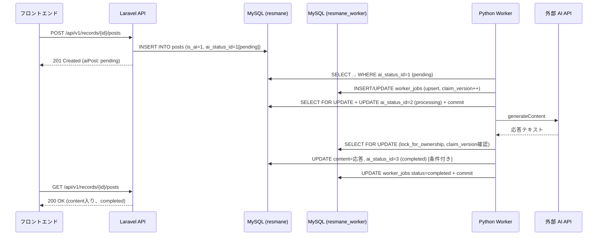
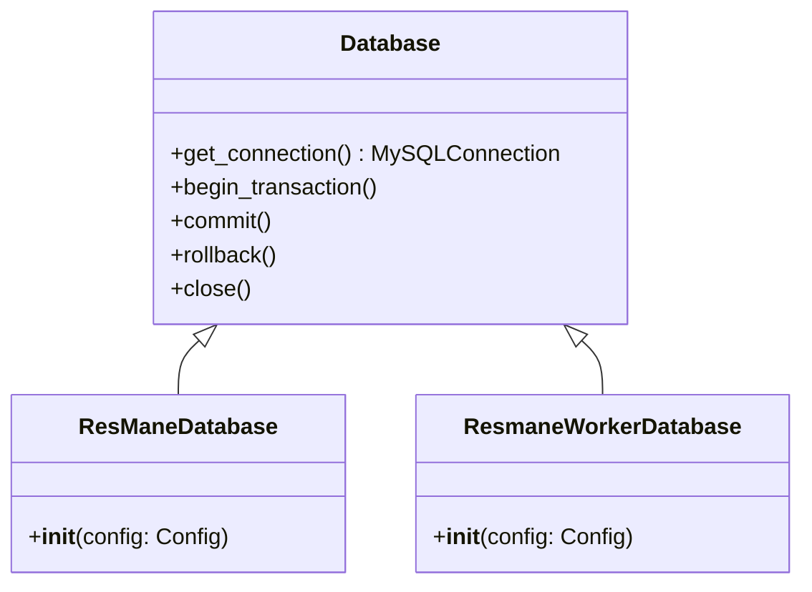
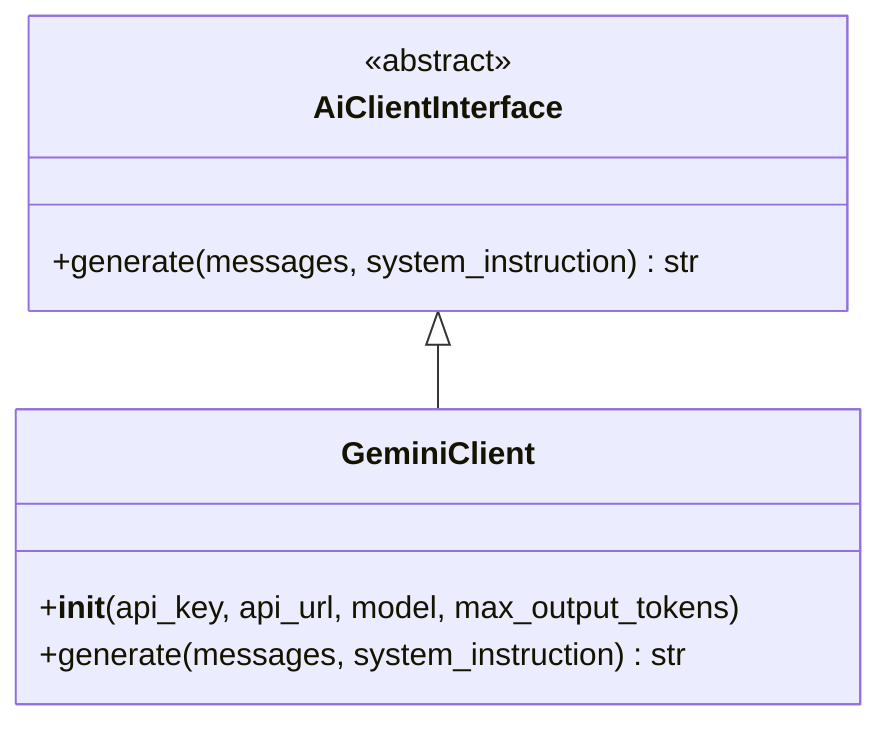
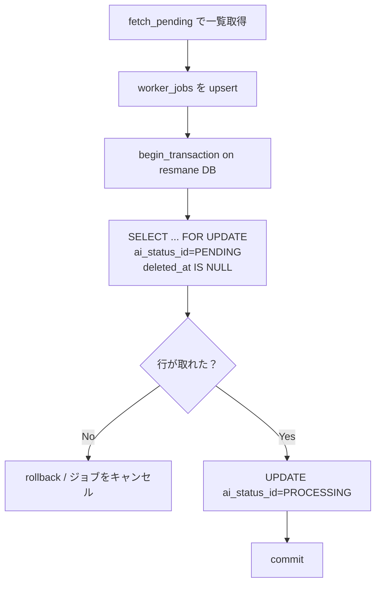
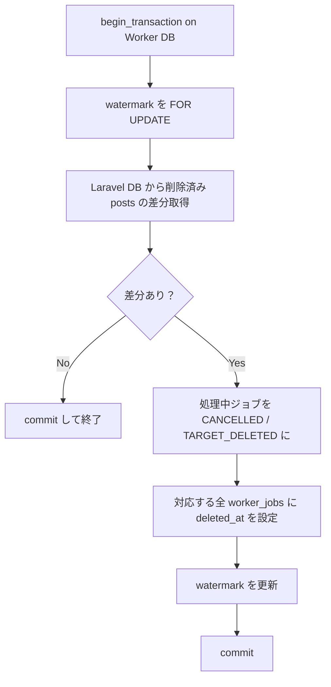

# 最新型家計簿！「レスマネ」　BG設計書（バックグラウンド処理）

## 1. 文書情報

| 項目           | 内容                       |
| -------------- | -------------------------- |
| 文書名         | BG設計書                   |
| プロジェクト名 | 最新型家計簿！「レスマネ」 |
| チーム名       | 節約志向になりたい         |
| 作成日         | 2026-07-21                 |
| 最終更新日     | 2026-07-21                 |
| 作成者         | 小川 悠馬                  |
| 版数           | v1.0                       |

### 1.1 改訂履歴

| 版数 | 日付       | 更新者    | 更新内容 |
| ---- | ---------- | --------- | -------- |
| v1.0 | 2026-07-21 | 小川 悠馬 | 初版作成 |

---

## 2. 前提

本書は、要件定義書・API設計書・技術構成書に基づき、Python Worker によるバックグラウンド処理（AIフィードバック生成）の設計を定義する。

### 2.1 設計方針

| 項目               | 方針                                                                                       |
| ------------------ | ------------------------------------------------------------------------------------------ |
| Laravel 非干渉     | Laravel 側は結合テスト・APIテスト中のため、Worker 固有の事情で Laravel 側の migration を作らない |
| Worker 専用 DB     | Worker 固有のデータ（ジョブ管理等）は `resmane_worker` データベースで管理する                 |
| テスタビリティ     | 全クラスがコンストラクタインジェクション（DI）。Repository / Client は抽象クラス + 具象クラスで、テスト時にモック差し替え可能 |
| トランザクション制御 | Service 層の責務とする。Repository はクエリ実行のみ                                         |
| AI API 非依存      | AiClientInterface を介して呼び出す。API プロバイダの変更は具象クラスの差し替えで対応          |

### 2.2 関連文書

- 要件定義書（`docs/要件定義/要件定義書.md`）— F-008（AIフィードバック）、F-011（AIコミュニケーション）
- API設計書（`docs/API設計/API設計書.md`）— §6 AI生成フロー
- 技術構成書（`docs/技術構成/技術構成書.md`）— §5.5 AI・バックグラウンド処理

---

## 3. アーキテクチャ概要

### 3.1 処理の位置づけ



### 3.2 2 つのデータベース

| データベース      | 用途                                               | 操作元        |
| ----------------- | -------------------------------------------------- | ------------- |
| `resmane`         | アプリケーション本体（posts, kakeibo_records 等）   | Laravel + Worker（読み書き） |
| `resmane_worker`  | Worker 専用（worker_jobs）                          | Worker のみ   |

分離する理由：Worker 固有のスキーマ変更が Laravel の migration・テストに影響しないようにするため。

---

## 4. ディレクトリ構成

```
worker/
├── main.py                              エントリーポイント（組み立て層）
├── requirements.txt
└── src/
    ├── configs/
    │   ├── config.py                    環境変数からの設定読み取り
    │   ├── ai_status.py                 AI ステータス定数（posts.ai_status_id）
    │   └── worker_status.py             Worker ジョブステータス・終了理由定数
    ├── databases/
    │   ├── database.py                  DB 接続管理の基底クラス
    │   ├── resmane_database.py          レスマネ本体 DB 接続
    │   ├── resmane_worker_database.py   Worker 専用 DB 接続
    │   └── migrations/
    │       ├── 001_create_worker_jobs_table.sql
    │       ├── 002_add_unique_post_id_to_worker_jobs.sql
    │       ├── 003_create_sync_watermarks_table.sql
    │       └── 004_add_claim_version_to_worker_jobs.sql
    ├── repositories/
    │   ├── contracts/
    │   │   ├── post_repository_interface.py
    │   │   ├── kakeibo_context_repository_interface.py
    │   │   ├── worker_job_repository_interface.py
    │   │   └── sync_watermark_repository_interface.py
    │   ├── post_repository.py
    │   ├── kakeibo_context_repository.py
    │   ├── worker_job_repository.py
    │   └── sync_watermark_repository.py
    ├── clients/
    │   ├── contracts/
    │   │   └── ai_client_interface.py
    │   └── gemini_client.py
    └── services/
        ├── feedback_service.py
        └── delete_sync_service.py
```

---

## 5. コンポーネント設計

### 5.1 Config（`src/configs/config.py`）

環境変数からの設定読み取りを一箇所に集約する。

| メソッド       | 説明                                       |
| -------------- | ------------------------------------------ |
| `__init__(…)`  | 全パラメータをコンストラクタ引数で受け取る |
| `from_env()`   | `os.environ` からインスタンスを生成する    |

テスト時は `Config(…)` で直接生成、本番は `Config.from_env()` を使用する。`os.environ` に触るのはこのクラスメソッドのみ。

### 5.2 定数クラス

#### AiStatus（`src/configs/ai_status.py`）

`ai_statuses` テーブル（Laravel シーダー）に対応する定数。

| 定数         | 値 | 説明     |
| ------------ | -- | -------- |
| `PENDING`    | 1  | 生成待ち |
| `PROCESSING` | 2  | 生成中   |
| `COMPLETED`  | 3  | 生成完了 |
| `FAILED`     | 4  | 生成失敗 |

#### WorkerStatus（`src/configs/worker_status.py`）

`worker_jobs.status` カラムの値。

| 定数            | 値                | 説明                         |
| --------------- | ----------------- | ---------------------------- |
| `PROCESSING`    | `"processing"`    | 処理中                       |
| `RETRY_PENDING` | `"retry_pending"` | リトライ待ち（次回 claim 可） |
| `COMPLETED`     | `"completed"`     | 正常完了                     |
| `FAILED`        | `"failed"`        | AI 障害による失敗            |
| `CANCELLED`     | `"cancelled"`     | 対象削除等によるキャンセル   |

#### TerminationReason（`src/configs/worker_status.py`）

`worker_jobs.termination_reason` カラムの値。

| 定数                    | 値                       | 説明                 |
| ----------------------- | ------------------------ | -------------------- |
| `TARGET_DELETED`        | `"target_deleted"`        | 対象投稿が削除済み     |
| `STATE_INCONSISTENCY`   | `"state_inconsistency"`   | 状態不整合によるキャンセル |
| `MAX_RETRIES_EXCEEDED`  | `"max_retries_exceeded"`  | リトライ上限到達       |

### 5.3 Database（`src/databases/`）



| クラス                  | 接続先           | 用途                           |
| ----------------------- | ---------------- | ------------------------------ |
| `Database`              | —（基底クラス）  | 接続管理・トランザクション制御 |
| `ResManeDatabase`       | `resmane`        | posts, kakeibo_records 等      |
| `ResmaneWorkerDatabase` | `resmane_worker` | worker_jobs                    |

`autocommit=True` で接続し、トランザクションが必要な箇所は Service 層から `begin_transaction()` / `commit()` / `rollback()` で明示的に制御する。

### 5.4 Repository（`src/repositories/`）

Laravel 側の Repository Interface パターンに準じ、`contracts/` に ABC（抽象基底クラス）、直下に具象クラスを配置する。

#### PostRepository

| メソッド           | 説明                                                                 |
| ------------------ | -------------------------------------------------------------------- |
| `fetch_pending()`       | `is_ai=1`, `ai_status_id=PENDING`, `deleted_at IS NULL` の投稿を取得 |
| `find_for_update()`     | `SELECT … FOR UPDATE` で pending の投稿を排他ロック付きで取得       |
| `update_status()`       | `ai_status_id` を更新する                                            |
| `save_response()`       | 条件付き UPDATE で `content` + `completed` を原子的に書き込む。削除済み or processing 以外なら `False` |
| `mark_failed()`         | 条件付き UPDATE で PROCESSING → FAILED。削除済み or processing 以外なら `False` |
| `force_fail()`          | PENDING or PROCESSING → FAILED の条件付き遷移。stale 上限到達専用    |
| `get_ai_status()`       | 投稿の `ai_status_id` と `deleted_at` を取得。存在しなければ `None`   |
| `fetch_deleted_since()`  | 複合カーソル (`deleted_at + id`) 以降に論理削除された AI 投稿を取得  |
| `recover_to_pending()`  | PROCESSING かつ未削除の投稿を PENDING に戻す。条件不一致なら `False`  |

`save_response()` / `mark_failed()` は以下の SQL で原子的に処理する。SELECT + UPDATE の間に削除される競合を防ぐ。

```sql
UPDATE posts
SET ai_status_id = ?, content = ?, updated_at = ?
WHERE id = ?
  AND deleted_at IS NULL
  AND ai_status_id = 2  -- PROCESSING
```

更新件数が `0` なら、削除済みまたは状態変更済みとして書き戻しを中止する。

#### KakeiboContextRepository

| メソッド               | 説明                                                   |
| ---------------------- | ------------------------------------------------------ |
| `fetch_record()`       | 家計簿レコードをカテゴリ名・収支区分名付きで取得（JOIN） |
| `fetch_self_reviews()` | 家計簿レコードに紐づく自己レビューを取得               |
| `fetch_thread()`       | 既存の投稿履歴を取得（ユーザー投稿 + completed な AI 投稿のみ） |

#### WorkerJobRepository

| メソッド              | 説明                                                       |
| --------------------- | ---------------------------------------------------------- |
| `lock_for_ownership(job_id, cv)` | `SELECT FOR UPDATE` で `status=PROCESSING AND claim_version=?` を検証 |
| `upsert(post_id)`               | 原子的 claim。成功なら `(job_id, claim_version)`、失敗なら `None`     |
| `mark_completed(job_id, cv)`     | ジョブを完了にする。所有権不一致なら `False`                          |
| `mark_failed(job_id, cv, error)` | ジョブを失敗にする。所有権不一致なら `False`                          |
| `mark_cancelled(job_id, cv, reason)` | ジョブをキャンセルにする。所有権不一致なら `False`                |
| `get_retry_info(job_id)`         | `retry_count` と `max_retries` を取得する                             |
| `increment_retry_and_pend(job_id, cv, error)` | `retry_count` インクリメント + `RETRY_PENDING` に遷移。所有権不一致なら `False` |
| `fetch_stale(timeout_sec)`       | PROCESSING のまま一定時間経過したジョブを取得（`claim_version` 含む） |
| `cancel_processing_by_post_ids(post_ids)` | 指定 post_id の PROCESSING ジョブを CANCELLED にする         |
| `soft_delete_by_post_ids(post_ids)`       | 指定 post_id の全ジョブに `deleted_at` を設定する             |

#### SyncWatermarkRepository

| メソッド           | 説明                                                     |
| ------------------ | -------------------------------------------------------- |
| `get_for_update()` | `INSERT IGNORE` で初期行を確保後、`SELECT FOR UPDATE` で排他取得 |
| `save()`           | watermark を upsert する                                  |

### 5.5 Client（`src/clients/`）



`AiClientInterface` のメッセージ形式は API 非依存の汎用形式とする。

```json
[
  {"role": "user", "content": "..."},
  {"role": "assistant", "content": "..."}
]
```

`GeminiClient` が内部で Gemini API 形式（`role: "model"`, `parts: [{"text": …}]`）に変換する。将来ユーザーごとにモデル・API プロバイダを選択する場合は、`AiClientInterface` の別の具象クラスを作るだけで対応できる。

#### Gemini API 呼び出し

| 項目             | 値                                     |
| ---------------- | -------------------------------------- |
| エンドポイント   | `{AI_API_URL}/models/{AI_MODEL}:generateContent` |
| 認証             | `x-goog-api-key` ヘッダーで送信       |
| タイムアウト     | 60 秒                                 |
| `maxOutputTokens`| 1500（デフォルト）                     |
| デフォルトモデル | `gemini-3.5-flash`                     |

### 5.6 Service（`src/services/feedback_service.py`）

ポーリング → コンテキスト取得 → AI 呼び出し → 結果書き戻しを統括する。トランザクション制御はこの層の責務。

---

## 6. 処理フロー

### 6.1 ポーリングサイクル

```
while True:
    schedule.run_pending()   ← 30 秒間隔
    touch /tmp/worker_healthy
    sleep(1)
```

各ポーリング (30 秒間隔) で以下を順に実行する。削除同期が失敗した場合、後続処理は中止する。

1. **delete_sync.sync()** — 削除同期を最優先
2. **feedback.recover_stale()** — タイムアウトしたジョブを回収
3. **feedback.process_pending()** — 新規 pending を処理

別途、1 時間間隔で `delete_sync.reconcile()` を実行し、commit 順逆転による取りこぼしを全件照合で回収する。

### 6.2 claim（排他制御）



- **worker_jobs を先に永続化**してから posts を更新する。posts 更新前に Worker が停止した場合、worker_jobs から孤立した PROCESSING 投稿を照合して回収できる
- `posts` の更新（レスマネ本体 DB）と `worker_jobs` の更新（Worker 専用 DB）は別 DB のため、トランザクションを分離する
- AI 呼び出し中は DB トランザクションも行ロックも保持しない

### 6.3 初回フィードバック vs 追加チャット

`posts.parent_id` で判別する。システムプロンプトは共通ペルソナ（`PERSONA_BASE`）とタスク別指示の組み合わせで構成し、未信頼データ（`record['details']` 等）を system ロールに含めない。

| 条件                   | 種別             | システムプロンプト (`system_instruction`)                      | メッセージ (`messages`)                             |
| ---------------------- | ---------------- | ------------------------------------------------------------- | --------------------------------------------------- |
| `parent_id IS NULL`    | 初回フィードバック | `PERSONA_BASE` + `INITIAL_TASK_INSTRUCTION`                  | 家計簿情報 + 自己レビュー（user メッセージ）        |
| `parent_id IS NOT NULL`| 追加チャット      | `PERSONA_BASE` + `FOLLOWUP_TASK_INSTRUCTION`                 | 参照データ（user メッセージ）+ スレッド履歴          |

- `PERSONA_BASE`: 人格・口調・基本姿勢・フィードバック構造・情報の扱い・禁止事項・プロンプトインジェクション防御を共通定義（AI ペルソナ定義書準拠）
- `INITIAL_TASK_INSTRUCTION`: 3〜5文の回答長・状況別方針
- `FOLLOWUP_TASK_INSTRUCTION`: 柔軟な回答長・話題範囲制限・範囲外の丁寧な断り

初回フィードバックでは家計簿情報をユーザーメッセージとして送信する。追加チャットでは家計簿情報を messages 先頭の user メッセージ（参照データ）として送信し、続けてスレッド履歴（ユーザー投稿 + completed な AI 投稿の交互）を渡す。家計簿情報を system ロールに含めないのは、ユーザー入力（`details` 等）を system 権限に昇格させないためである。

### 6.4 削除済み防止

claim 後 〜 AI 応答後の間に家計簿やユーザーが削除された場合の扱い。

| 状態                                    | `posts.ai_status_id` | `worker_jobs.status` | 備考                         |
| --------------------------------------- | --------------------- | -------------------- | ---------------------------- |
| 正常完了                                | `COMPLETED`           | `completed`          |                              |
| AI 障害                                 | `FAILED`              | `failed`             | `last_error` にエラー内容    |
| 対象が削除済み（`save_response` で検出）| `PROCESSING`（凍結）  | `cancelled`          | `termination_reason = target_deleted` |

削除済みの `posts` を `FAILED` へ更新する必要はない。`FAILED` は「有効な生成要求に対して AI 処理が失敗した」という API 上の状態であり、要求自体が処理対象から消えたケースとは区別する。

`save_response()` / `mark_failed()` は条件付き UPDATE（`deleted_at IS NULL AND ai_status_id = PROCESSING`）で原子的に処理するため、SELECT と UPDATE の間に削除される競合は発生しない。

stale recovery は `posts.deleted_at IS NULL` のみを対象とするため、凍結状態の行を拾わない。

### 6.5 3000 文字制限

`posts.content` は `VARCHAR(3000)` であるため、AI 応答がこれを超える場合は `FAILED` とする。

| ガード     | 方法                                           |
| ---------- | ---------------------------------------------- |
| Gemini 側  | `generationConfig.maxOutputTokens = 1500` で出力トークン数を制限 |
| Python 側  | `len(response) > 3000` なら `mark_failed()` で FAILED にする      |

truncate して不完全な応答を保存するのではなく、FAILED としてリトライの余地を残す。

### 6.6 リトライ

リトライ時はジョブの状態を `RETRY_PENDING` に遷移させ、stale 判定と区別する。

| 状態           | `posts.ai_status_id` | `worker_jobs.status` | 説明                   |
| -------------- | --------------------- | -------------------- | ---------------------- |
| AI 処理中      | `PROCESSING`          | `PROCESSING`         | AI 呼び出し中          |
| リトライ待ち   | `PENDING`             | `RETRY_PENDING`      | 次回ポーリングで再 claim |
| 再 claim       | `PROCESSING`          | `PROCESSING`         | `claimed_at` を更新    |

| 条件                             | 動作                                                 |
| -------------------------------- | ---------------------------------------------------- |
| AI API 一時エラー / 文字数超過   | `posts` → PENDING、`worker_jobs` → `RETRY_PENDING`   |
| `retry_count < max_retries` (3)  | 次回ポーリングで `RETRY_PENDING → PROCESSING` の条件付き claim |
| `retry_count >= max_retries`     | `posts` → FAILED、`worker_jobs` → FAILED。ユーザーの手動再試行待ち |

`upsert()` は `INSERT IGNORE` (初回、`claim_version=1`) → `RETRY_PENDING → PROCESSING` の条件付き UPDATE (リトライ、`claim_version` インクリメント) の 2 段階で原子的に claim する。claim に負けた Worker は共有ジョブを変更しない。

#### 所有権確認 (claim_version)

Laravel DB を変更する全てのパスで、以下のロック順を統一する。

1. Worker DB: `begin_transaction()` → `lock_for_ownership(job_id, claim_version)` で `SELECT ... FOR UPDATE`
2. 所有権確認成功 → Laravel DB の条件付き更新 (`save_response` / `recover_to_pending` / `mark_failed`)
3. Worker DB: ジョブの状態遷移 (`mark_completed` / `increment_retry_and_pend` 等)
4. Worker DB: `commit()`

所有権確認に失敗した場合は `rollback()` して Laravel DB に一切触れない。これにより、古い Worker が stale recovery 後のジョブや他の Worker の処理中投稿を書き換えることを防ぐ。

AI 呼び出し中にロックは保持しない。ロック保持は結果書き戻しの短いトランザクションのみ。

### 6.7 stale recovery

Worker 異常終了で PROCESSING のまま残ったジョブを回収する。

| 条件                                                             | 動作               |
| ---------------------------------------------------------------- | ------------------- |
| `worker_jobs.status = processing` かつ `claimed_at` から 300 秒経過 | stale と判定       |
| `retry_count < max_retries`                                      | PENDING に戻して再投入 |
| `retry_count >= max_retries`                                     | FAILED にする       |

stale recovery は投稿の現在状態を取得し、以下の状態表に基づいて修復する。

| `posts.ai_status_id` | `worker_jobs` の修復                             |
| --------------------- | ------------------------------------------------ |
| `PENDING`             | `RETRY_PENDING` へ戻して再 claim 可能にする       |
| `PROCESSING`          | 投稿を `PENDING` へ、ジョブを `RETRY_PENDING` へ |
| `COMPLETED`           | ジョブを `COMPLETED` へ                           |
| `FAILED`              | ジョブを `FAILED` へ                              |
| 削除済み・存在しない  | `CANCELLED` / `TARGET_DELETED`                   |

「条件付き更新に失敗した = 削除済み」とは限らないため、`get_ai_status()` で投稿の現在状態を確認してから判断する。

### 6.8 削除同期

Laravel DB でユーザー退会・家計簿削除・投稿削除が行われた場合、Worker DB の関連データも同期して論理削除する。

#### 同期対象

v0.1 では `posts.deleted_at` の差分同期のみ。現 API 設計では家計簿削除・退会時にも関連する `posts` が論理削除されるため、`posts` の同期だけで全ケースをカバーできる。

`users` / `kakeibo_records` の個別同期は、将来 Worker DB へユーザー単位・家計簿単位の要約を保存する段階で追加する。

#### watermark 方式

`sync_watermarks` テーブルに `table_name` + `last_deleted_at` + `last_id` の複合 watermark を保存する。時刻のみだと同一時刻の行を取りこぼすため、`deleted_at + id` の複合条件で差分を取得する。

複合カーソル (`deleted_at + id`) で差分を取得する。

```sql
WHERE deleted_at > :last_deleted_at
   OR (deleted_at = :last_deleted_at AND id > :last_id)
ORDER BY deleted_at, id
LIMIT :batch_size
```

増分同期だけでは commit 順逆転（Tx A が Tx B より先に削除したが後に commit）を拾えないため、1 時間間隔で `reconcile()` を実行し、全削除済み AI 投稿をページング付きで全件照合する。

#### 処理フロー



- watermark 取得から watermark 更新まで Worker DB 側で単一トランザクション
- 失敗時は rollback して次回ポーリングで再実行（冪等）
- `COMPLETED` / `FAILED` のジョブは `status` を変えず `deleted_at` のみ設定

#### ポーリング順

```python
delete_sync_service.sync()         # 1. 削除同期を最優先
feedback_service.recover_stale()   # 2. タイムアウト分を回収
feedback_service.process_pending() # 3. 新規 pending を処理
```

削除同期の直後にユーザーが削除する競合は残るため、`save_response()` の条件付き UPDATE も引き続き必要。

---

## 7. Worker 専用テーブル

### 7.1 worker_jobs

| カラム             | 型               | 説明                           |
| ------------------ | ---------------- | ------------------------------ |
| `id`               | BIGINT UNSIGNED PK | AUTO_INCREMENT                |
| `post_id`          | BIGINT UNSIGNED  | 対象の `posts.id`              |
| `status`           | VARCHAR(20)      | WorkerStatus 定数              |
| `claim_version`    | INT UNSIGNED     | claim のたびにインクリメント。所有権確認に使用 |
| `claimed_at`       | DATETIME         | processing に切り替えた時刻    |
| `retry_count`      | INT UNSIGNED     | 現在のリトライ回数（デフォルト 0） |
| `max_retries`      | INT UNSIGNED     | リトライ上限（デフォルト 3）   |
| `last_error`       | TEXT NULL        | 直近の失敗理由（AI 障害専用）  |
| `termination_reason` | VARCHAR(40) NULL | 終了理由（TerminationReason 定数） |
| `created_at`       | DATETIME         |                                |
| `updated_at`       | DATETIME         |                                |
| `deleted_at`       | DATETIME NULL    | 論理削除                       |

UNIQUE: `post_id` / INDEX: `status`

### 7.2 sync_watermarks

| カラム            | 型               | 説明                                   |
| ----------------- | ---------------- | -------------------------------------- |
| `id`              | BIGINT UNSIGNED PK | AUTO_INCREMENT                        |
| `table_name`      | VARCHAR(64)      | 同期対象テーブル名（UNIQUE）           |
| `last_deleted_at` | DATETIME         | 前回同期した最後の `deleted_at`（初期値 1970-01-01） |
| `last_id`         | BIGINT UNSIGNED  | 前回同期した最後の `id`（初期値 0）     |
| `updated_at`      | DATETIME         |                                        |

UNIQUE: `table_name`

### 7.3 マイグレーションルール

- マイグレーションファイルは `worker/src/databases/migrations/` に連番（`001_`, `002_`, …）で配置する
- **1 度でも実行 または GitHub に push した時点で immutable**。それ以前（開発中・未適用）なら書き直し可
- immutable 化後のスキーマ変更はすべて ALTER TABLE ベースで新しいマイグレーションファイルを追加する

---

## 8. 環境変数

| 変数名                      | 説明                         | デフォルト値     |
| --------------------------- | ---------------------------- | ---------------- |
| `WORKER_DB_HOST`            | レスマネ本体 DB ホスト        | `db`             |
| `WORKER_DB_PORT`            | レスマネ本体 DB ポート        | `3306`           |
| `WORKER_DB_NAME`            | レスマネ本体 DB 名            | `resmane`        |
| `WORKER_DB_USER`            | レスマネ本体 DB ユーザー      | —                |
| `WORKER_DB_PASSWORD`        | レスマネ本体 DB パスワード    | —                |
| `WORKER_OWN_DB_HOST`        | Worker 専用 DB ホスト         | `db`             |
| `WORKER_OWN_DB_PORT`        | Worker 専用 DB ポート         | `3306`           |
| `WORKER_OWN_DB_NAME`        | Worker 専用 DB 名             | `resmane_worker` |
| `WORKER_OWN_DB_USER`        | Worker 専用 DB ユーザー       | —                |
| `WORKER_OWN_DB_PASSWORD`    | Worker 専用 DB パスワード     | —                |
| `WORKER_POLL_INTERVAL_SEC`  | ポーリング間隔（秒）         | `30`             |
| `WORKER_STALE_TIMEOUT_SEC`  | stale 判定タイムアウト（秒）  | `300`            |
| `AI_API_KEY`                | AI API キー                   | —                |
| `AI_API_URL`                | AI API ベース URL             | —                |
| `AI_MODEL`                  | AI モデル名                   | `gemini-3.5-flash` |

---

## 9. Docker 構成

`compose.example.yml` に Worker サービスの定義がデフォルトで有効になっている。起動前に `.env` の `AI_API_KEY` に有効な Gemini API キーを設定すること。

```bash
docker compose up -d --build
```

Worker は外部からの接続を受けないため `expose` / `ports` は不要。ヘルスチェックは `/tmp/worker_healthy` の mtime で判定可能。

Worker コンテナの Dockerfile は `docker/worker/Dockerfile` に配置し、`worker/` ディレクトリをマウントする。環境変数は `.env` ファイルから `env_file` で読み込む。

---

## 10. 関連文書

- 要件定義書（`docs/要件定義/要件定義書.md`）
- API設計書（`docs/API設計/API設計書.md`）
- 技術構成書（`docs/技術構成/技術構成書.md`）
- コーディング規約（`docs/開発ルール/コーディング規約.md`）
- テーブル定義書（`docs/DB設計/テーブル定義書.xls`）
