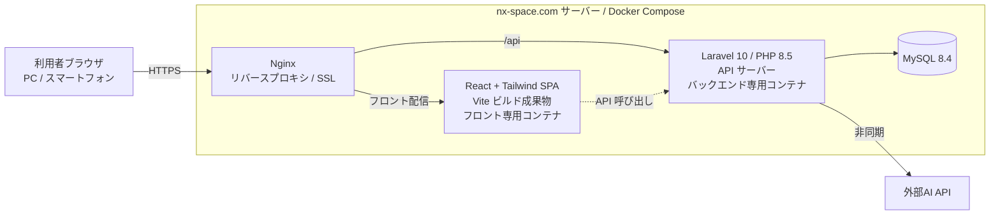

# 最新型家計簿！「レスマネ」　技術構成書

## 1. 文書情報

| 項目           | 内容                       |
| -------------- | -------------------------- |
| 文書名         | 技術構成書                 |
| プロジェクト名 | 最新型家計簿！「レスマネ」 |
| チーム名       | 節約志向になりたい         |
| 作成日         | 2026-05-29                 |
| 最終更新日     | 2026-05-29                 |
| 作成者         | 節約志向になりたい         |
| 版数           | v1.0                       |

### 1.1 改訂履歴

| 版数 | 日付       | 更新者    | 更新内容 |
| ---- | ---------- | --------- | -------- |
| v1.0 | 2026-05-29 | 小川 悠馬 | 初版作成 |

---

## 2. 前提

本書は、要件定義書「最新型家計簿！『レスマネ』」で「別途決定」とした採用技術を確定するものである。
インフラの稼働方針（Nginx / MySQL を共通基盤とし、本プロジェクト用に専用コンテナ・専用 OS / DB ユーザーを設ける等）は要件定義書 3 章に従う。

---

## 3. 技術スタック一覧

| 層                       | 採用技術              | バージョン | 備考                                       |
| ------------------------ | --------------------- | ---------- | ------------------------------------------ |
| フロントエンド言語       | TypeScript            | 5 系       | 型を活用する                               |
| フロントエンド           | React                 | 18 系      | UI ライブラリ                              |
| スタイリング             | Tailwind CSS          | 3 系       | ユーティリティファースト                   |
| フロントビルド           | Vite                  | 5 系       | React + TS の標準ビルドツール（高速HMR・本番最適化、フロント独立） |
| バックエンド言語         | PHP                   | 8.5        |                                            |
| バックエンドフレームワーク | Laravel               | 10 系      | -                                          |
| データベース             | MySQL                 | 8.4        | 共通基盤                                   |
| リバースプロキシ / SSL   | Nginx + Certbot       | -          | 共通基盤（Let's Encrypt 自動更新）         |
| 実行環境                 | Docker Compose        | -          | 本プロジェクト用に専用コンテナを構築       |
| パッケージ管理           | Composer / npm        | -          | バックエンド / フロントエンド              |

---

## 4. 構成図

> **フロントエンド（React）とバックエンド（Laravel API）は分離する。** Nginx がパスで振り分け（フロント配信 / `/api` → Laravel）、Laravel と React を同一アプリに混在させない（ルーティングの衝突を避けるため）。Nginx と MySQL は共通基盤、レスマネの Web / App 層は専用コンテナとして構築する（要件定義書 3 章準拠）。

---

## 5. 各層の方針

### 5.1 フロントエンド

| 項目         | 内容                                                         |
| ------------ | ------------------------------------------------------------ |
| 構成         | React による SPA。Nginx が静的配信し、Laravel の API を呼び出す（バックエンドと分離） |
| 言語         | TypeScript                                                   |
| ライブラリ   | React                                                        |
| スタイリング | Tailwind CSS（ユーティリティファースト）                     |
| ビルド       | Vite                                                         |
| 画面方針     | 原則スマートフォン画面を基準とし、PC は Tailwind のレスポンシブ（メディアクエリ）で調整する |
| AIスレッド   | 家計簿詳細とスレッドの表示切替（S-005）はクライアント側で行う |

### 5.2 バックエンド

| 項目           | 内容                                                       |
| -------------- | ---------------------------------------------------------- |
| 提供形態       | API サーバー（JSON）として提供し、画面描画は行わない（フロントと分離） |
| 言語           | PHP 8.5                                                    |
| フレームワーク | Laravel 10                                                 |
| 認証           | ログインID + パスワードによるセッションベース認証          |
| AI生成処理     | 外部AI APIの呼び出しは画面操作と分離した非同期処理として行う |
| APIキー管理    | 利用する外部サービスのキーはサーバー側で一元管理する。メール送信は nx-space.com の既存メールサーバーを利用する |

### 5.3 データベース

| 項目         | 内容                                           |
| ------------ | ---------------------------------------------- |
| RDBMS        | MySQL 8.4（共通基盤）                          |
| アクセス     | Laravel（Eloquent ORM）経由                    |
| ユーザー分離 | レスマネ専用 DB ユーザーを用い、最小権限で運用 |

### 5.4 インフラ / 実行環境

| 項目             | 内容                                                 |
| ---------------- | ---------------------------------------------------- |
| 実行             | Docker Compose 上のレスマネ専用コンテナ              |
| リバースプロキシ | Nginx（共通基盤）                                    |
| SSL              | Let's Encrypt（Certbot で自動取得・自動更新）        |
| アクセス制御     | 開発・検証段階は WireGuard による VPN 経由に限定する |

---

## 6. 関連文書

- 要件定義書（`docs/要件定義/要件定義書.md`）
- コーディング規約（`docs/開発ルール/コーディング規約.md`）
