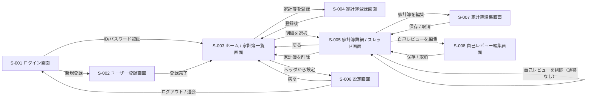

# 最新型家計簿！「レスマネ」　要件定義書

## 1. 文書情報

| 項目           | 内容                       |
| -------------- | -------------------------- |
| 文書名         | 要件定義書                 |
| プロジェクト名 | 最新型家計簿！「レスマネ」 |
| チーム名       | 節約志向になりたい         |
| 作成日         | 2026-05-26                 |
| 最終更新日     | 2026-07-31                 |
| 作成者         | 節約志向になりたい         |
| 版数           | v1.1                       |

### 1.1 改訂履歴

| 版数 | 日付       | 更新者    | 更新内容 |
| ---- | ---------- | --------- | -------- |
| v0.1 | 2026-05-26 | 小川 悠馬 | 初版作成 |
| v1.0 | 2026-05-29 | 小川 悠馬 | 機能・画面・データ・AI利用・監査性の各要件を詳細化し、未決事項 Q-001〜Q-012 を整理（Q-004 を除き決定）。チーム体制を更新 |
| v1.1 | 2026-07-31 | 小川 悠馬 | 発表資料担当を確定（上森）。Q-004 解決により未決事項を全件完了 |

---

## 2. 前提

本要件定義書は、企画書「最新型家計簿！『レスマネ』」を前提とし、開発対象となるシステムの要件を整理するものである。

企画の背景、企画意図、タイトル背景、差別化、競合調査、訴求内容については、企画書および発表資料で扱う。

---

## 3. 開発・検証環境要件

開発段階では、外部AI API等のAPIキーを各メンバーのローカル環境に分散させず、開発・検証用サーバー側で一元管理する。
そのため、本プロジェクトでは nx-space.com サーバー上に開発・検証用環境を用意し、開発段階におけるアクセスはVPN経由に限定する。

| 項目                     | 要件                                                                                                  |
| ------------------------ | ----------------------------------------------------------------------------------------------------- |
| 開発・検証用サーバー     | nx-space.com サーバー上に開発・検証用環境を用意する                                                   |
| 利用目的                 | チーム内での動作確認、結合確認、発表前デモ確認に利用する                                              |
| 公開範囲                 | 開発段階では一般公開しない                                                                            |
| アクセス制御             | 開発・検証用環境へのアクセスはVPN経由に限定する                                                       |
| APIキー管理              | 本システムが実際に利用する外部サービスのAPIキーを、各メンバーのローカル環境へ分散させず、開発・検証用サーバー側で一元管理する。メール送信は nx-space.com の既存メールサーバーを利用し、メール送信用の外部APIキーは扱わない |
| アプリケーション側の保護 | VPNによる到達制限とは別に、必要な認証・認可・入力値検証を行う                                         |
| 本番利用                 | 一般公開サービスとしての運用は初期開発範囲に含めない                                                  |

### 3.1 nx-space.com サーバー仕様

開発・検証用に利用する `nx-space.com` サーバーの構成は以下の通り。

#### ハードウェア / OS

| 項目       | 内容             |
| ---------- | ---------------- |
| OS         | Ubuntu 26.04 LTS |
| CPU        | 4 vCPU           |
| メモリ     | 8 GB             |
| ストレージ | NVMe SSD 200 GB  |

#### 利用可能な技術要素

本プロジェクトで利用想定する技術要素。すべて Docker Compose 上で稼働する。

| 層                                        | ミドルウェア                                   | 備考                                 |
| ----------------------------------------- | ---------------------------------------------- | ------------------------------------ |
| リバースプロキシ / SSL                    | Nginx + Certbot（Let's Encrypt 自動更新）      | 共通基盤                             |
| データベース                              | MySQL 8.4                                      | 共通基盤                             |
| Web サーバー / アプリケーションランタイム | 採用技術は別途決定（フレームワーク採用も含む） | 本プロジェクト用に専用コンテナを構築 |

#### ネットワーク / アクセス制御

| 項目                 | 内容                                   |
| -------------------- | -------------------------------------- |
| 公開ポート           | TCP 80 / 443（Web）                    |
| 開発・検証用アクセス | WireGuard による VPN 経由のみとする    |
| SSL                  | Let's Encrypt による自動取得・自動更新 |

#### セキュリティ機構

| 項目                   | 内容                                                                                                                                     |
| ---------------------- | ---------------------------------------------------------------------------------------------------------------------------------------- |
| ファイアウォール       | UFW（公開ポート以外は遮断）                                                                                                              |
| 不正アクセス自動遮断   | fail2ban（閾値超過で自動 BAN）                                                                                                           |
| サーバー側ユーザー管理 | 本プロジェクト用に専用 OS ユーザー・DB ユーザーを作成し、他サービスとアクセス境界を分離する。ファイル権限・DB 権限は最小権限の原則に従う |

#### 本プロジェクトに関する留意事項

- 本サーバーには既に他のサービスが稼働しているため、リソース・ポート・サブドメインは既存サービスと共存させる必要がある。
- 本プロジェクト用のサブドメイン・データベース・Docker サービスの構成は別途決定する。

---

## 4. 対象利用者

### 4.1 利用者一覧

| 利用者種別     | 説明                                                           | 主な利用内容                                                   |
| -------------- | -------------------------------------------------------------- | -------------------------------------------------------------- |
| 一般利用者     | 本システムを利用して、自分のお金の使い方を記録・確認する利用者 | 支出に関する情報の入力、購入後の考えや評価の入力、AIの返信確認 |
| システム運用者 | システムの運用・管理を行う担当者                               | データ管理、障害対応、必要に応じた利用者対応                   |

### 4.2 想定利用環境

| 項目           | 内容                                                  |
| -------------- | ----------------------------------------------------- |
| 利用者層       | お金の管理が苦手な20代前後の学生                      |
| 利用端末       | PC、スマートフォン (スマートフォンがメインになりそう) |
| 利用場所       | 自宅、学校、外出先など                                |
| 利用タイミング | 買い物後、支出を見直したい時、給料日前など            |

---

## 5. システム目的

### 5.1 目的

本システムの目的は、ユーザーが日々のお金の使い方を記録し、購入後に自分の考えや評価を入力できるようにすることで、お金の使い方を見直しやすくすることである。

また、ユーザーが入力した内容に対してAIの返信を表示することで、今後のお金の使い方に活かせる状態を目指す。

### 5.2 達成すべき状態

| ID    | 達成すべき状態                                                   |
| ----- | ---------------------------------------------------------------- |
| G-001 | ユーザーが支出に関する情報を登録できる                           |
| G-002 | ユーザーが登録した内容を後から確認できる                         |
| G-003 | ユーザーが購入後の考えや評価を入力できる                         |
| G-004 | ユーザーが入力した内容に対してAIの返信を確認できる               |
| G-005 | 支出に関する情報、ユーザー入力、AIの返信が関連づいた状態で扱える |
| G-006 | PCおよびスマートフォンから利用できる                             |

---

## 6. チーム体制

| 役割                     | 担当者                   | 内容                                                      |
| ------------------------ |-----------------------| --------------------------------------------------------- |
| チームリーダー           | 上森 悠久                 | チーム全体の進行管理                                      |
| 書記・日報               | 小川 悠馬                 | 話し合いの記録、日報作成                                  |
| フロントエンド           | 上森 悠久、田中 颯秋、淺田 希良     | 画面作成、UI実装                                          |
| バックエンド             | 小川 悠馬、髙木陽成            | サーバー側処理、API、DB連携                               |
| データベース             | 小川 悠馬、髙木陽成            | テーブル設計、データ管理                                  |
| AI・バックグラウンド関連 | 小川 悠馬                 | AI連携、外部API連携、AI生成処理の非同期化、生成結果の管理 |
| 発表資料                 | 上森 悠久                 | 中間発表・最終発表の資料作成                              |

---

## 7. スコープ

### 7.1 開発対象

| 項目         | 内容                                                       |
| ------------ | ---------------------------------------------------------- |
| 開発対象     | Webアプリケーション                                        |
| 主な対象     | 支出に関する情報の管理、購入後のユーザー入力、AIの返信表示 |
| 対象利用者   | 一般利用者                                                 |
| 対象端末     | PC、スマートフォン                                         |
| 対象ブラウザ | 主要なWebブラウザ                                          |

### 7.2 対象外

| 項目                                      | 理由                                                   |
| ----------------------------------------- | ------------------------------------------------------ |
| 金融機関との連携                          | 授業課題として扱うには実装難易度と責任範囲が大きいため |
| 決済機能                                  | 本システムの目的が支払い処理ではないため               |
| 投資・資産運用の助言                      | 本システムの目的ではなく、責任範囲が大きいため         |
| 他ユーザーとの本格的な交流機能 (MVP 除外) | プライバシー管理や投稿管理の要件が大きくなるため       |
| 不特定多数に向けた投稿公開 (MVP 除外)     | 個人的な支出内容を扱うため、初期開発の範囲では扱わない |
| 高度な家計分析                            | 初期開発では、日々の記録と購入後の評価を優先するため   |
| システム運用者向けの管理画面              | 初期開発では運用者操作をサーバー側（DB・ログ確認等）で対応するため |

---

## 8. 利用フロー

### 8.1 基本フロー

1. ユーザーがシステムにアクセスする
2. ユーザーが支出に関する情報を入力する
3. ユーザーが購入後の考えや評価を入力する
4. システムが入力内容を保存する
5. AIがユーザーの入力内容に対して返信を生成する
6. ユーザーがAIの返信を確認する
7. ユーザーが過去の入力内容を確認する

### 8.2 利用シナリオ

| ID    | シナリオ             | 内容                                                                   |
| ----- | -------------------- | ---------------------------------------------------------------------- |
| U-001 | 買い物後の入力       | ユーザーが買ったものや金額を入力し、その購入について自分の考えを残す   |
| U-002 | 給料日前の確認       | ユーザーが過去の支出を確認し、お金の使い方を見直す                     |
| U-003 | 趣味・娯楽支出の確認 | ユーザーが趣味や娯楽に使ったお金について、満足度や後悔の有無を確認する |
| U-004 | AIの返信確認         | ユーザーが自分の入力内容に対するAIの返信を確認する                     |

---

## 9. 機能要件

### 9.1 機能一覧

| ID    | 機能名               | 概要                                                       | 優先度 | 備考                       |
| ----- | -------------------- | ---------------------------------------------------------- | ------ | -------------------------- |
| F-001 | ユーザー登録         | 利用者がアカウントを新規作成する                           | 3      |                            |
| F-002 | ログイン             | 登録済みの利用者を認証し、本人のデータを利用可能にする     | 3      |                            |
| F-003 | 家計簿登録           | 利用者の支出・収入を記録する                               | 5      |                            |
| F-004 | 家計簿閲覧           | 登録した支出・収入を一覧および詳細で確認する               | 5      |                            |
| F-005 | 基準値設定           | 使用する金額の上限目安値 / 割合 の登録                     | 5      |                            |
| F-006 | 自己レビュー投稿     | 個人の家計簿のレビューを投稿する                           | 5      |                            |
| F-007 | 自己レビュー閲覧     | 投稿した自己レビューとAIの返信を確認する                   | 5      |                            |
| F-008 | AIフィードバック     | AIが家計簿や自己レビューに対して返信する                   | 4      |                            |
| F-009 | ユーザー情報編集     | 登録済みの利用者情報を変更する                             | 2      |                            |
| F-010 | ユーザー退会         | アカウントと関連データを削除する                           | 2      |                            |
| F-011 | AIコミュニケーション | AIフィードバック後のコミュニケーションなど                 | 3      | スレッド形式でやり取りする |
| F-012 | 家計簿編集           | 登録済みの支出・収入を修正する                             | 4      |                            |
| F-013 | 家計簿削除           | 登録済みの支出・収入を削除する                             | 3      |                            |
| F-014 | 自己レビュー編集     | 投稿済みの自己レビューを修正する                           | 4      |                            |
| F-015 | 自己レビュー削除     | 投稿済みの自己レビューを削除する                           | 3      | 削除時に画面遷移しない      |

### 9.2 機能詳細

#### F-001

| 項目         | 内容                                                                       |
| ------------ | -------------------------------------------------------------------------- |
| 機能名       | ユーザー登録                                                               |
| 目的         | 利用者がアカウントを新規作成する                                           |
| 利用者       | 一般利用者（未登録）                                                       |
| 入力         | ログインID、パスワード、メールアドレス、名前                               |
| 処理         | 入力値をサーバー側で検証し、ログインIDの重複を確認のうえ、パスワードをハッシュ化して利用者を登録する |
| 出力         | 登録完了の表示、ログイン後の画面への遷移                                   |
| 例外・エラー | 必須項目の未入力、ログインIDの重複、メール形式不正、パスワード要件未達     |
| 備考         | メールアドレスは必須（スパム防止・パスワード再発行・緊急告知の用途で保持する） |

#### F-002

| 項目         | 内容                                                               |
| ------------ | ------------------------------------------------------------------ |
| 機能名       | ログイン                                                           |
| 目的         | 登録済みの利用者を認証し、本人のデータにアクセスできるようにする   |
| 利用者       | 一般利用者                                                         |
| 入力         | ログインID、パスワード                                             |
| 処理         | 入力された認証情報をサーバー側で検証し、一致した場合にセッションを開始して利用を許可する |
| 出力         | 認証成功時はログイン後の画面へ遷移、失敗時はエラーを表示する       |
| 例外・エラー | 認証情報の不一致、必須項目の未入力、未登録の利用者                 |
| 備考         | ログインID + パスワードによるセッションベース認証。パスワードはハッシュ化して保存する |

#### F-003

| 項目         | 内容                                                         |
| ------------ | ------------------------------------------------------------ |
| 機能名       | 家計簿登録                                                   |
| 目的         | 利用者の支出・収入を記録する                                 |
| 利用者       | 一般利用者                                                   |
| 入力         | 金額、購入内容、日付、区分（支出・収入）、カテゴリ           |
| 処理         | 入力値をサーバー側で検証し、利用者に紐づけて保存する         |
| 出力         | 登録完了の表示、および家計簿一覧への反映                     |
| 例外・エラー | 必須項目の未入力、金額が不正な値                             |
| 備考         | カテゴリ等の入力項目の詳細は基本設計で定める                 |

#### F-004

| 項目         | 内容                                                       |
| ------------ | ---------------------------------------------------------- |
| 機能名       | 家計簿閲覧                                                 |
| 目的         | 登録した支出・収入を一覧および詳細で確認する               |
| 利用者       | 一般利用者                                                 |
| 入力         | 表示期間などの絞り込み条件                                 |
| 処理         | 利用者に紐づく家計簿を取得し、一覧・詳細として整形する     |
| 出力         | 支出・収入の一覧、基準値に対する利用状況、個別の明細       |
| 例外・エラー | データの取得失敗                                           |
| 備考         | ホーム（S-003）と家計簿詳細（S-005）で表示する             |

#### F-005

| 項目         | 内容                                                       |
| ------------ | ---------------------------------------------------------- |
| 機能名       | 基準値設定                                                 |
| 目的         | 使用する金額の上限目安値 / 割合を登録する                  |
| 利用者       | 一般利用者                                                 |
| 入力         | 上限目安値、割合                                           |
| 処理         | 入力値を検証し、利用者に紐づけて保存する                   |
| 出力         | 設定の保存完了、ホームでの利用状況表示への反映             |
| 例外・エラー | 不正な値（負数・範囲外）                                   |
| 備考         |                                                            |

#### F-006

| 項目         | 内容                                                           |
| ------------ | -------------------------------------------------------------- |
| 機能名       | 自己レビュー投稿                                               |
| 目的         | 個別の家計簿に対する購入後の考えや評価を投稿する               |
| 利用者       | 一般利用者                                                     |
| 入力         | 自己レビューの内容（自由記述）                                 |
| 処理         | 入力値を検証し、対象の家計簿に紐づけて保存する                 |
| 出力         | スレッドへの自己レビューの表示                                 |
| 例外・エラー | 文字数超過、対象の家計簿が存在しない                           |
| 備考         | 投稿を契機に AIフィードバック（F-008）が自動生成される         |

#### F-007

| 項目         | 内容                                                           |
| ------------ | -------------------------------------------------------------- |
| 機能名       | 自己レビュー閲覧                                               |
| 目的         | 投稿済みの自己レビューとAIの返信を確認する                     |
| 利用者       | 一般利用者                                                     |
| 入力         | 対象の家計簿（スレッド）の選択                                 |
| 処理         | 対象に紐づく自己レビューとAIメッセージを取得し、スレッドとして整形する |
| 出力         | スレッド表示                                                   |
| 例外・エラー | データの取得失敗                                               |
| 備考         | S-005 でスレッドとして表示する                                 |

#### F-008

| 項目         | 内容                                                                                   |
| ------------ | -------------------------------------------------------------------------------------- |
| 機能名       | AIフィードバック                                                                       |
| 目的         | AIが家計簿や自己レビューに対して返信する                                               |
| 利用者       | 一般利用者                                                                             |
| 入力         | 対象となる家計簿の情報、自己レビューの内容（任意）、システム側で付与する出力方針       |
| 処理         | 自己レビューの投稿時に自動生成するほか、利用者の操作による生成も行う。自己レビューが無い場合でも家計簿情報をもとに生成できる。生成は画面操作と分離した非同期処理として行う |
| 出力         | AIが生成した返信文（肯定的な反応・見直しの視点・必要に応じた注意喚起）を画面に表示する |
| 例外・エラー | 生成失敗、応答遅延、外部サービス利用不可、不適切な内容の生成                           |
| 備考         | 外部AI APIを利用する。生成結果は保存する（スレッドの再表示・継続のため）。生成失敗時の再試行は妨げないが、成功した返信を作り直す再生成機能は設けない |

#### F-009

| 項目         | 内容                                                       |
| ------------ | ---------------------------------------------------------- |
| 機能名       | ユーザー情報編集                                           |
| 目的         | 登録済みの利用者情報を変更する                             |
| 利用者       | 一般利用者                                                 |
| 入力         | 変更後の情報（パスワード、メールアドレス等）               |
| 処理         | 入力値を検証し、利用者情報を更新する。パスワード変更時はハッシュ化して保存する |
| 出力         | 更新完了の表示                                             |
| 例外・エラー | 必須項目の未入力、メール形式不正、現パスワードの不一致     |
| 備考         | ログインIDの変更可否は基本設計で定める                     |

#### F-010

| 項目         | 内容                                                       |
| ------------ | ---------------------------------------------------------- |
| 機能名       | ユーザー退会                                               |
| 目的         | アカウントと関連データを削除する                           |
| 利用者       | 一般利用者                                                 |
| 入力         | 退会の確認                                                 |
| 処理         | 確認のうえ、利用者と関連データを削除する                   |
| 出力         | 退会完了の表示、S-001 ログイン画面への遷移                 |
| 例外・エラー | 認証切れ                                                   |
| 備考         | 削除範囲（家計簿・自己レビュー・AIメッセージ）は基本設計で定める |

#### F-011

| 項目         | 内容                                                           |
| ------------ | -------------------------------------------------------------- |
| 機能名       | AIコミュニケーション                                           |
| 目的         | AIフィードバック後に、利用者とAIがスレッド形式でやり取りする   |
| 利用者       | 一般利用者                                                     |
| 入力         | AIへの追加のメッセージ（自由記述）                             |
| 処理         | スレッドの文脈とともに入力をAIへ送り、返信を非同期で生成する   |
| 出力         | 生成された返信文をスレッドに追加表示する                       |
| 例外・エラー | 生成失敗、応答遅延、外部サービス利用不可                       |
| 備考         | 生成結果は保存する（D-005）                                    |

#### F-012

| 項目         | 内容                                                       |
| ------------ | ---------------------------------------------------------- |
| 機能名       | 家計簿編集                                                 |
| 目的         | 登録済みの支出・収入を修正する                             |
| 利用者       | 一般利用者                                                 |
| 入力         | 修正後の金額、購入内容、日付、区分（支出・収入）、カテゴリ |
| 処理         | 入力値を検証し、対象の家計簿を更新する                     |
| 出力         | 更新完了の表示、一覧・詳細への反映                         |
| 例外・エラー | 必須項目の未入力、金額が不正な値、対象が存在しない         |
| 備考         | S-007 家計簿編集画面で行う                                 |

#### F-013

| 項目         | 内容                                                       |
| ------------ | ---------------------------------------------------------- |
| 機能名       | 家計簿削除                                                 |
| 目的         | 登録済みの支出・収入を削除する                             |
| 利用者       | 一般利用者                                                 |
| 入力         | 削除の確認                                                 |
| 処理         | 確認のうえ、対象の家計簿を削除する                         |
| 出力         | 削除完了の表示、S-003 ホームへの遷移                       |
| 例外・エラー | 対象が存在しない                                           |
| 備考         | 紐づく自己レビュー・AIメッセージの扱いは基本設計で定める   |

#### F-014

| 項目         | 内容                                                       |
| ------------ | ---------------------------------------------------------- |
| 機能名       | 自己レビュー編集                                           |
| 目的         | 投稿済みの自己レビューを修正する                           |
| 利用者       | 一般利用者                                                 |
| 入力         | 修正後の自己レビューの内容                                 |
| 処理         | 入力値を検証し、対象の自己レビューを更新する               |
| 出力         | 更新完了の表示、スレッドへの反映                           |
| 例外・エラー | 文字数超過、対象が存在しない                               |
| 備考         | S-008 自己レビュー編集画面で行う。編集に伴うAIの再生成は行わない |

#### F-015

| 項目         | 内容                                                       |
| ------------ | ---------------------------------------------------------- |
| 機能名       | 自己レビュー削除                                           |
| 目的         | 投稿済みの自己レビューを削除する                           |
| 利用者       | 一般利用者                                                 |
| 入力         | 削除の確認                                                 |
| 処理         | 確認のうえ、対象の自己レビューを削除する                   |
| 出力         | 削除完了の表示、スレッドからの除去（画面遷移しない）       |
| 例外・エラー | 対象が存在しない                                           |
| 備考         | 画面遷移せず S-005 内で完結する。紐づくAIメッセージの扱いは基本設計で定める |

---

## 10. 画面要件

### 10.1 画面一覧

| 画面ID | 画面名                       | 概要                                                                   | 利用者     | 備考                                   |
| ------ | ---------------------------- | ---------------------------------------------------------------------- | ---------- | -------------------------------------- |
| S-001  | ログイン画面                 | 登録済みの利用者が認証情報を入力してログインする                       | 一般利用者 | F-002                                  |
| S-002  | ユーザー登録画面             | 利用者がアカウントを新規作成する                                       | 一般利用者 | F-001                                  |
| S-003  | ホーム / 家計簿一覧画面      | 登録済みの支出・収入を一覧表示し、各機能への入口となる                 | 一般利用者 | F-004                                  |
| S-004  | 家計簿登録画面               | 支出・収入の内容を入力して登録する                                     | 一般利用者 | F-003                                  |
| S-005  | 家計簿詳細 / スレッド画面    | 「家計簿詳細」と「スレッド（自己レビュー・AIの返信）」を同一画面内で切り替えて表示する | 一般利用者 | F-006・F-007・F-008・F-011             |
| S-006  | 設定画面                     | 基準値設定、ユーザー情報編集、退会を行う                               | 一般利用者 | F-005・F-009・F-010                    |
| S-007  | 家計簿編集画面               | 登録済みの家計簿（支出・収入）を修正する                               | 一般利用者 | F-012                                  |
| S-008  | 自己レビュー編集画面         | 投稿済みの自己レビューを修正する                                       | 一般利用者 | F-014                                  |

### 10.2 画面詳細

#### S-001

| 項目     | 内容                                                       |
| -------- | ---------------------------------------------------------- |
| 画面名   | ログイン画面                                               |
| 目的     | 登録済みの利用者を認証する                                 |
| 利用者   | 一般利用者                                                 |
| 表示内容 | ログインIDとパスワードの入力欄、ログインボタン、ユーザー登録画面への導線 |
| 入力項目 | ログインID、パスワード                                     |
| 操作     | ログイン、ユーザー登録画面へ移動                           |
| 遷移元   | （未ログイン状態での初期画面）                             |
| 遷移先   | S-003 ホーム / 家計簿一覧画面、S-002 ユーザー登録画面      |
| 備考     | F-002。ログインID + パスワードによるセッションベース認証   |

#### S-002

| 項目     | 内容                                               |
| -------- | -------------------------------------------------- |
| 画面名   | ユーザー登録画面                                   |
| 目的     | 利用者がアカウントを新規作成する                   |
| 利用者   | 一般利用者                                         |
| 表示内容 | ログインID・パスワード・メールアドレス・名前の入力欄、登録ボタン、ログイン画面への導線 |
| 入力項目 | ログインID、パスワード、メールアドレス、名前       |
| 操作     | 登録、ログイン画面へ移動                           |
| 遷移元   | S-001 ログイン画面                                 |
| 遷移先   | S-003 ホーム / 家計簿一覧画面、S-001 ログイン画面  |
| 備考     | F-001。メールアドレスは必須（スパム防止・パスワード再発行・緊急告知の用途で保持する） |

#### S-003

| 項目     | 内容                                                             |
| -------- | ---------------------------------------------------------------- |
| 画面名   | ホーム / 家計簿一覧画面                                          |
| 目的     | 登録済みの支出・収入を確認し、各機能の入口とする                 |
| 利用者   | 一般利用者                                                       |
| 表示内容 | 支出・収入の一覧、基準値に対する利用状況、各画面への導線         |
| 入力項目 | 表示期間などの絞り込み条件                                       |
| 操作     | 家計簿登録画面・詳細画面・設定画面への移動                       |
| 遷移元   | S-001 ログイン画面、S-002 ユーザー登録画面、各画面からの戻り     |
| 遷移先   | S-004 家計簿登録画面、S-005 家計簿詳細 / スレッド画面、S-006 設定画面 |
| 備考     | F-004                                                            |

#### S-004

| 項目     | 内容                                               |
| -------- | -------------------------------------------------- |
| 画面名   | 家計簿登録画面                                     |
| 目的     | 支出・収入を入力して登録する                       |
| 利用者   | 一般利用者                                         |
| 表示内容 | 入力フォーム、登録ボタン                           |
| 入力項目 | 金額、購入内容、日付、区分（支出・収入）、カテゴリ |
| 操作     | 登録、入力の取り消し                               |
| 遷移元   | S-003 ホーム / 家計簿一覧画面                      |
| 遷移先   | S-003 ホーム / 家計簿一覧画面                      |
| 備考     | F-003                                              |

#### S-005

| 項目     | 内容                                                                       |
| -------- | -------------------------------------------------------------------------- |
| 画面名   | 家計簿詳細 / スレッド画面                                                                                       |
| 目的     | 個別の家計簿の詳細と、それに対する自己レビュー・AIの返信を扱う                                                  |
| 利用者   | 一般利用者                                                                                                     |
| 表示内容 | 「家計簿詳細」と「スレッド（自己レビュー・AIの返信・以降のやり取り）」を切り替えて表示する。両方を同時には表示しない |
| 入力項目 | 自己レビューの内容、AIへの追加のメッセージ                                                                     |
| 操作     | 家計簿詳細とスレッドの表示切替、自己レビューの投稿、AIフィードバックの確認、AIとのやり取り、家計簿の編集（S-007 へ遷移）・削除、自己レビューの編集（S-008 へ遷移）・削除 |
| 遷移元   | S-003 ホーム / 家計簿一覧画面                                                                                  |
| 遷移先   | S-003 ホーム / 家計簿一覧画面、S-007 家計簿編集画面、S-008 自己レビュー編集画面                                |
| 備考     | F-006・F-007・F-008・F-011・F-013・F-015。家計簿詳細とスレッドの切替は同一パス内で JavaScript により行う（同時表示は情報過多となるため避ける）。家計簿の削除（F-013）は確認のうえ実行し、削除後は S-003 へ戻る。自己レビューの削除（F-015）は確認のうえ実行し、画面遷移せず S-005 内で完結する。AI生成中・生成失敗時の表示を含む |

#### S-006

| 項目     | 内容                                                       |
| -------- | ---------------------------------------------------------- |
| 画面名   | 設定画面                                                   |
| 目的     | 基準値設定、ユーザー情報の編集、退会を行う                 |
| 利用者   | 一般利用者                                                 |
| 表示内容 | 基準値設定欄、ユーザー情報の編集欄、退会の導線             |
| 入力項目 | 上限目安値 / 割合、変更後の利用者情報                      |
| 操作     | 基準値の保存、ユーザー情報の更新、退会、ログアウト         |
| 遷移元   | S-003 ホーム / 家計簿一覧画面                              |
| 遷移先   | S-003 ホーム / 家計簿一覧画面、S-001 ログイン画面（退会・ログアウト時） |
| 備考     | F-005・F-009・F-010                                        |

#### S-007

| 項目     | 内容                                               |
| -------- | -------------------------------------------------- |
| 画面名   | 家計簿編集画面                                     |
| 目的     | 登録済みの家計簿（支出・収入）を修正する           |
| 利用者   | 一般利用者                                         |
| 表示内容 | 対象の家計簿の現在値を反映した入力フォーム、保存ボタン |
| 入力項目 | 金額、購入内容、日付、区分（支出・収入）、カテゴリ |
| 操作     | 修正内容の保存、編集の取り消し                     |
| 遷移元   | S-005 家計簿詳細 / スレッド画面                    |
| 遷移先   | S-005 家計簿詳細 / スレッド画面                    |
| 備考     | F-012                                              |

#### S-008

| 項目     | 内容                                                       |
| -------- | ---------------------------------------------------------- |
| 画面名   | 自己レビュー編集画面                                       |
| 目的     | 投稿済みの自己レビューを修正する                           |
| 利用者   | 一般利用者                                                 |
| 表示内容 | 対象の自己レビューの現在の内容を反映した入力フォーム、保存ボタン |
| 入力項目 | 自己レビューの内容                                         |
| 操作     | 修正内容の保存、編集の取り消し                             |
| 遷移元   | S-005 家計簿詳細 / スレッド画面                            |
| 遷移先   | S-005 家計簿詳細 / スレッド画面                            |
| 備考     | F-014。自己レビューの削除（F-015）は S-005 内で完結し、本画面は経由しない |

### 10.3 画面遷移

- 未ログインの利用者は S-001 ログイン画面から開始する。アカウントを持たない場合は S-002 ユーザー登録画面へ移動し、登録後にログイン状態となる。
- ログイン（ID / パスワード認証）後は、S-003 ホーム / 家計簿一覧画面を起点（メニュー）とし、各画面へ遷移する。各画面は操作後に S-003 へ戻る。
- 設定（S-006）はヘッダから利用でき、基準値設定・ユーザー情報編集・退会・ログアウトを行う。退会またはログアウトを行うと S-001 ログイン画面へ戻る。
- 自己レビューの投稿、AIフィードバックの表示、AIとのやり取りは、いずれも S-005 家計簿詳細 / スレッド画面の中で完結し、画面遷移は発生しない。
- S-005 から家計簿の編集（S-007 家計簿編集画面）へ遷移できる。保存または取消の後は S-005 へ戻る。
- 家計簿の削除は S-005 で行い、削除後は S-003 ホーム / 家計簿一覧画面へ戻る。
- S-005 から自己レビューの編集（S-008 自己レビュー編集画面）へ遷移できる。保存または取消の後は S-005 へ戻る。
- 自己レビューの削除は S-005 のスレッド内で行い、画面遷移は発生しない（家計簿の削除が S-003 へ戻るのと区別する）。

---

## 11. データ要件

### 11.1 扱うデータ

| データ種別                       | 内容                                     | 備考                                   |
| -------------------------------- | ---------------------------------------- | -------------------------------------- |
| 利用者に関するデータ             | 利用者を識別するための情報               | 認証方式により内容が変わる             |
| 支出に関するデータ               | 金額、購入内容、日付など、支出を表す情報 | 個人の生活状況が推測される可能性がある |
| 購入後にユーザーが入力するデータ | 購入後の考えや評価など                   | 自由記述を含む可能性がある             |
| AIによって生成される文章         | ユーザー入力に対して生成された文章       | スレッドの再表示・継続のため保存する   |
| システム管理上のデータ           | エラー情報、不正利用（の疑い）の記録など | プライバシー保護のため通常操作は記録しない |

### 11.2 データ一覧

| ID    | データ名         | 内容                                               | 保存目的                                   | 備考                                           |
| ----- | ---------------- | -------------------------------------------------- | ------------------------------------------ | ---------------------------------------------- |
| D-001 | 利用者           | ログインID、パスワード（ハッシュ化）、メールアドレス、名前 | 利用者ごとにデータを扱い、認証・連絡を行うため | メールアドレスは必須（スパム防止・パスワード再発行・緊急告知の用途）。パスワードはハッシュ化して保存する |
| D-002 | 家計簿レコード   | 金額、購入内容、日付、区分（支出・収入）、カテゴリ | 支出・収入を記録し、後から確認するため     | 個人の生活状況が推測される可能性がある         |
| D-003 | 基準値設定       | 上限目安値 / 割合                                  | 支出の見直しの目安として利用するため       | 利用者ごとに保持する                           |
| D-004 | 自己レビュー     | 購入後の考えや評価などの自由記述                   | 購入後の振り返りを記録するため             | 個人的な感情や後悔が含まれる可能性がある       |
| D-005 | AIメッセージ     | AIが生成した返信文、利用者とのやり取りの履歴       | 自己レビューに対するAIの返信を扱うため     | スレッドの再表示・継続のため保存する           |

### 11.3 データ取り扱い上の注意

| 項目             | 注意点                                           |
| ---------------- | ------------------------------------------------ |
| 支出金額         | 個人の生活状況が推測される可能性がある           |
| 購入内容         | 趣味、嗜好、生活習慣が含まれる可能性がある       |
| 自由記述         | 個人的な感情や後悔が含まれる可能性がある         |
| AIに送信する情報 | 外部サービスを利用する場合、送信範囲を明確にする |
| 表示範囲         | 他の利用者に見せる情報と見せない情報を区別する   |
| 保存期間         | 不要なデータを長期間保持しすぎないようにする     |

---

## 12. AI利用要件

### 12.1 AIの役割

AIは、ユーザーが入力した支出に関する内容をもとに、ユーザーがお金の使い方を見直しやすくなる文章を生成する。

AIは、ユーザーの支出を一方的に否定するためではなく、ユーザー自身の考えを整理しやすくするために利用する。

### 12.2 AIに入力する情報

| 項目                     | 内容                         | 備考                         |
| ------------------------ | ---------------------------- | ---------------------------- |
| 支出に関する情報         | 金額、購入内容、日付など     | 送信範囲を制限する場合がある |
| ユーザーが入力した内容   | 購入後の考えや評価など       | 自由記述を含む可能性がある   |
| システム側で付与する条件 | 出力方針、禁止事項、文体など | AIに対する指示として扱う     |

### 12.3 AIが出力する内容

| 項目             | 内容                                                       |
| ---------------- | ---------------------------------------------------------- |
| 肯定的な反応     | ユーザーの行動や考え方の良い点を示す                       |
| 見直しの視点     | 次回以降のお金の使い方に活かせる視点を示す                 |
| 注意喚起         | 必要に応じて、使いすぎや無理のある支出に気づける表現を行う |
| 継続しやすい表現 | 強く責める表現ではなく、継続しやすい表現を行う             |

### 12.4 AIが行わないこと

| 項目                 | 理由                                           |
| -------------------- | ---------------------------------------------- |
| 投資助言             | 本システムの目的ではなく、責任範囲が大きいため |
| 金融商品の推奨       | 本システムの目的ではないため                   |
| 支出の強い否定       | 継続しやすさを損なう可能性があるため           |
| ユーザーを責める表現 | システム目的に反するため                       |
| 絶対的な判断         | 支出の価値は利用者ごとに異なるため             |
| 法的・金融的な断定   | 専門的責任を伴う内容であるため                 |

### 12.5 AI利用時のエラー対応

| 状況                           | 対応                                             |
| ------------------------------ | ------------------------------------------------ |
| AIの生成に失敗した場合         | ユーザーにエラーを表示し、再試行できるようにする |
| AIの応答に時間がかかる場合     | 処理中であることを表示する                       |
| AIが不適切な内容を返した場合   | 出力方針（プロンプト）で抑制し、表示制御を行う   |
| 外部サービスが利用できない場合 | AIを使わない範囲の操作を妨げない                 |

---

## 13. 非機能要件

### 13.1 性能要件

| 項目       | 要件                                                       |
| ---------- | ---------------------------------------------------------- |
| 画面表示   | 通常利用に支障がない速度で表示されること                   |
| 入力処理   | 入力後、利用者が過度に待たされないこと                     |
| AI生成処理 | AI利用時は待ち時間が発生する可能性を考慮すること           |
| 同時利用   | 授業内発表およびデモで利用できる程度の同時利用に耐えること |

### 13.2 可用性要件

| 項目                   | 要件                                                                                                           |
| ---------------------- | -------------------------------------------------------------------------------------------------------------- |
| 利用可能時間           | 授業、開発、発表時に利用できること                                                                             |
| 障害時対応             | エラー発生時に原因調査ができること                                                                             |
| データ保護             | 必要なデータが不意に失われないようにすること                                                                   |
| AI生成処理の分離       | 外部AI APIの応答遅延や一時的な失敗によって、画面表示・入力処理・主要操作全体が利用不能にならないようにすること |
| AI利用不可時の継続利用 | AIによる文章生成が利用できない場合でも、支出に関する情報の入力・保存・確認を妨げないこと                       |
| 再試行                 | AIの生成に失敗した場合、ユーザーの入力内容を失わず、再試行できるようにすること                                 |
| タイムアウト影響の低減 | AI生成処理の遅延により、通常の画面操作や入力処理でタイムアウトや503エラーが発生しにくい構成にすること          |

### 13.3 セキュリティ要件

| 項目           | 要件                                                           |
| -------------- | -------------------------------------------------------------- |
| 認証           | 利用者ごとのデータを扱う場合、利用者を識別できること           |
| 認可           | 他の利用者のデータを不適切に閲覧・操作できないこと             |
| 入力値検証     | 利用者入力はサーバー側で検証すること                           |
| XSS対策        | 画面に表示する文字列は適切にエスケープすること                 |
| CSRF対策       | 状態を変更する操作ではCSRF対策を行うこと                       |
| パスワード管理 | パスワードを扱う場合は、安全にハッシュ化して保存すること       |
| 個人情報の扱い | 支出内容や自由記述に個人的な情報が含まれる可能性を考慮すること |
| AI送信データ   | 外部サービスを利用する場合、送信する情報の範囲を明確にすること |

### 13.4 監査性要件

本システムは、個人的な支出内容や自由記述を扱うため、プライバシー保護の観点から、利用者の通常操作の内容はログに残さない。記録対象は、エラーおよび不正な利用（またはその疑い）に限定する。

| 項目             | 要件                                                                                                       |
| ---------------- | ---------------------------------------------------------------------------------------------------------- |
| エラー記録       | システムエラーや外部サービス連携エラーを確認できるようにする                                               |
| 不正利用の記録   | 不正な利用またはその疑いがある事象（認証失敗の多発、不正なアクセス・操作の試行など）を確認できるようにする |
| 通常操作の非記録 | プライバシー保護の観点から、利用者の通常操作・閲覧・入力したデータ内容はログに残さない                     |
| 記録内容の制限   | パスワード、APIキー、支出内容・自由記述などの個人情報をログに含めない                                      |
| 保管期間         | エラー・不正利用ログは一定期間（例：90日）を超えたものを削除する                                               |

### 13.5 保守性要件

本システムは、チーム開発で継続的に修正・拡張できるよう、各メンバーが担当範囲を理解しやすく、変更内容を追跡しやすい状態を保つ。

コードはGitで管理し、ブランチ運用やレビュー方法はチームで定めた開発ルールに従う。
また、複雑な処理や意図が伝わりにくい処理には、必要に応じてコメントを記述する。

開発環境は、特定の担当者だけに依存しないよう、再現可能な手順を整理する。

命名規則、ディレクトリ構成、詳細なコーディング規約については、使用技術や基本設計に依存するため、別途定める開発ルールを参照する。

### 13.6 ユーザビリティ要件

| 項目               | 要件                                                               |
| ------------------ | ------------------------------------------------------------------ |
| 操作の分かりやすさ | 初めて使う利用者でも基本操作が分かるようにすること                 |
| 入力負担           | 入力項目を増やしすぎず、継続しやすい量にすること                   |
| 画面表示           | 支出に関する情報とAIの返信の関係が分かるように表示すること         |
| スマートフォン対応 | 原則スマートフォン画面を基準に設計し、PC等の大きな画面は必要に応じてメディアクエリで調整すること |
| エラー表示         | 利用者が何を直せばよいか分かる表示にすること                       |

---

## 14. 受け入れ条件

| ID    | 条件                                                       | 判定方法     |
| ----- | ---------------------------------------------------------- | ------------ |
| A-001 | 主要機能が動作する                                         | 動作確認     |
| A-002 | 利用者が基本的な流れを実行できる                           | 画面操作確認 |
| A-003 | 入力したデータが正しく保存・表示される                     | データ確認   |
| A-004 | AIを利用する処理が想定した形式で動作する                   | 動作確認     |
| A-005 | 他の利用者のデータが不適切に表示されない                   | 権限確認     |
| A-006 | AIによる文章生成が失敗した場合でも、主要な操作が継続できる | 動作確認     |
| A-007 | 発表時にデモ可能な状態である                               | 発表前確認   |
| A-008 | 問題発生時に、必要な範囲で原因確認ができる記録が残る       | ログ確認     |

---

## 15. リスク・懸念点

| ID    | リスク                             | 影響                                           | 対応方針                                     |
| ----- | ---------------------------------- | ---------------------------------------------- | -------------------------------------------- |
| R-001 | 機能範囲が広がりすぎる             | 完成が難しくなる                               | 最小限の開発範囲を決め、優先度をつける       |
| R-002 | AI機能の実装難易度が高い           | 開発遅延につながる                             | AIなしでも成立する基本部分を確保する         |
| R-003 | メンバー間の技術力に差がある       | 作業の偏りや品質差が出る                       | 分担とサポート体制を調整する                 |
| R-004 | 他ユーザーとの交流機能を広げすぎる | 管理・プライバシー・実装範囲が大きくなる       | 初期開発では個人利用を中心にする             |
| R-005 | 支出内容が個人的な情報を含む       | プライバシー上の問題が出る                     | データの扱いと表示範囲を明確にする           |
| R-006 | AIが不適切な文章を生成する         | 利用者体験を損なう                             | 出力方針や制限を決める                       |
| R-007 | 外部サービスが利用できない         | 一部機能が利用できなくなる                     | AIを使わない範囲の操作を妨げない構成にする   |
| R-008 | APIキーの管理が分散する            | キー漏えい・設定不一致・管理負荷増加につながる | 開発・検証用サーバー側で一元管理する         |
| R-009 | 必要な記録が残らない               | 障害や不正操作の原因調査が難しくなる           | エラーおよび不正な利用（疑いを含む）について記録を残す |
| R-010 | 記録に不要な情報が含まれる         | 個人情報や機密情報の漏えいにつながる           | ログに含める情報の範囲を制限する             |

---

## 16. 未決事項

なし（全件解決済み）
